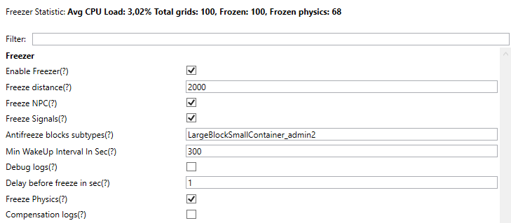

### Мониторинг нагрузки на физику от тяжелых кластеров/гридов
с оповещенеим игроков-владельцев структур и переводом структуры в статику 
(Нужен плагин Profiler)

Конфигурация:
 * **Enable physics guard** - вкл/выкл проверку нагрузки на физику
 * **Physics checks before** punish - Количество проваленных проверок до оповещения или конвертации в статику
 * **Physics ms to alert** - Если стуктура обсчитывается дольше указанного времени то игрок получает оповещение
 * **Physics ms to punish** - Если стуктура обсчитывается дольше указанного времени то структура становится статичной через некоторое количество проверок(Physics checks before punish)
 * **Physics ms to punish immediately** - Если стуктура обсчитывается дольше указанного времени то структура становится статичной немедленно

### Заморозка
Структуры рядом с которыми нет игроков перестают обсчитываться на сервере
Если на структуре есть производственные блоки то раз в **Min WakeUp Interval In Sec** секунд структура просыпается на несколько секунд,
и заводы/сборщики компенсируют время заморозки переработывая за следующий после разморозки тик большую пачку руды или собирая большую пачку помпонентов  

 * **Freeze Physics** - Если параметр включен, то динамические структуры которые 
не закреплены об что-то статическое, в некотором смысле становятся статикой

### Мониторинг нагрузки сварки динамики в сз

 * Сварка/распил динамики в сз, или особенно на границе сз может вызывать ощутимые микрофризы, 
такие динамические структуры в сз автоматически переводятся в статику если вызывают фризы больше **Safe zone Physics Threshold** миллисекунд

### Асинхроннная сварка
 * Параметр **Async weld** выносит поиск блоков для сварки в отдельный поток чем значительно уменьшает влияние на симуляцию

### Асинхроннная отправка клиенту игры данных о структурах/вокселях
 * Параметр **Fix Voxel Freeze Enabled** включает механизм при котором сжатие и отправка сущностей клиентам игры происходит в отдельном потоке.
В результате этого основной поток симуляции не фризит при сжатии данных для больших обёмов вокселей или больших структур
