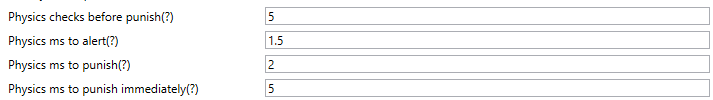
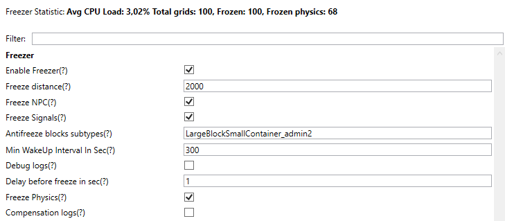

# SentisOptimisations

Плагин Torch для Space Engineers, который снимает нагрузку с сервера: заморозка гридов без игроков
(фризер), бюджеты и разнесение по кадрам тяжёлой работы (сварка проекций, заводы, буры, резаки,
генераторы, колёса, репликация, сохранение мира), сторож тяжёлой физики и тяжёлых скриптов, анти-чит и
исправления падений игры. Почти всё работает без настроек.

- [Установка](#установка)
- [Команды](#команды)
- [Настройки](#настройки)
- Нагрузка и защита: [физика](#защита-от-тяжёлой-физики), [программные блоки](#нагрузка-от-программируемых-блоков)
- [Заморозка (фризер)](#заморозка)
- [Безопасные зоны](#безопасные-зоны)
- Блоки: [сварка проекций](#сварка-проекций-без-фризов), [заводы](#очистительные-заводы-без-фризов),
  [буры](#корабельные-буры-без-фризов), [резаки](#резаки-меньше-работы-на-каждый-удар),
  [генераторы](#генераторы-o2h2-покадровый-пересчёт-раз-в-10-кадров), [колёса](#колёса-энергосистема-машины-раз-в-10-кадров),
  [прочее](#прочие-оптимизации)
- Сервер: [GC](#сборка-мусора-в-лёгких-кадрах), [сохранение мира](#сохранение-мира),
  [отправка вокселей](#отправка-планеты-подключающемуся-игроку-без-фриза), [репликация](#репликация-меньше-работы-на-кадр-при-многих-клиентах),
  [потоки Havok](#потоки-физики-havok)
- [Анти-чит](#анти-чит), [исправления падений](#исправления-падений-игры), [ошибка перевыпуска Torch](#исправление-ошибки-перевыпуска-методов-в-torch-reemitleavefix)
- [Замечания](#замечания)

## Установка

- Настройки хранятся в `Instance\SentisOptimisations.cfg` и правятся в GUI Torch по вкладкам.
- В GUI показывается статистика: CPU, число замороженных гридов, время физики
  (`Physics: X.XX ms/frame`) и секция `Scripts` с самыми тяжёлыми программными блоками.
- Каждый патч регистрируется через `PatchGuard`. Если цель патча в новой версии игры исчезла, выключается
  только эта функция, а не весь сервер.

## Команды

| Команда | Кто | Что делает |
|---|---|---|
| `!set_hydro [доля]` | админ | Заполнить все водородные баки грида, на который смотрите, до доли (по умолчанию 0.5). |
| `!clean_projectors` | админ | Выключить все проекторы мира и убрать их проекции. |
| `!ai_npc clean` | админ | Удалить личности NPC-персонажей (`Shadow_Bot`, `Space_Zombie`, `Drone_Bot`, `Alien_OB`, `Mutant`), а заодно пустые фракции, репутацию и GPS удалённых личностей и владение их блоками. |

## Настройки

Пример файла со всеми параметрами и комментарием к каждому: [`SentisOptimisations.cfg.example`](SentisOptimisations.cfg.example). Его можно скопировать в `Instance\SentisOptimisations.cfg` как есть.

| Вкладка | Параметр | По умолчанию | Что делает |
|---|---|---|---|
| Freezer | `Enable Freezer` | вкл | Заморозка гридов без игроков. |
| Freezer | `Freeze distance dynamic` / `static` | 10000 / 3000 | Дальше какого расстояния от игроков динамическая или статичная группа замерзает, м. |
| Freezer | `Freeze NPC` | выкл | Замораживать NPC-гриды. |
| Freezer | `Freeze Signals` | выкл | Замораживать контейнеры-сигналы (`Container MK-…`). |
| Freezer | `Antifreeze blocks subtypes` | `LargeBlockSmallContainer_admin2:LargeBlockSmallContainer_admin` | Грид с блоком одного из этих сабтипов (через `:`) не замерзает. |
| Freezer | `Freeze Physics` | выкл | Замораживать и физику. Переключается на лету. |
| Freezer | `Min WakeUp Interval In Sec` | 600 | Как часто замороженная группа с производством просыпается для компенсации. |
| Freezer | `Delay before freeze in sec` | 5 | Задержка перед заморозкой, когда игроки ушли. |
| Freezer | `Delay before freezer start in sec` | 5 | Задержка запуска фризера после загрузки мира. |
| Freezer | `Debug logs` / `Compensation logs` | вкл / вкл | Логи фризера и итоги компенсации производства. |
| Performance | `Enable physics guard` и пороги `Physics ms to …` | вкл, 1.5 / 2 / 5 мс, 5 проверок | Сторож тяжёлой физики, см. ниже. |
| Performance | `Gas Tank Optimisation` | вкл | Баки и вентиляция переносят газ одной пачкой вместо тридцати. |
| Performance | `Safe zone grid tracking` | вкл | Безопасные зоны находят динамические гриды по геометрии, а не через физику; сварка в зоне не нагружает физику. |
| Scripts | `Enable scripts punish` | выкл | Выводить из строя слишком тяжёлые программные блоки. |
| Scripts | `Scripts max exec time` | 2 | Предел одного запуска, мс. |
| Scripts | `Scripts max ms per frame` | 0.5 | Предел среднего времени на кадр, мс; 0 — выключен. |
| Scripts | `Scripts overtime exec times before punish` | 3 | Сколько превышений нужно для наказания. |
| Welder Optimizations | `Enabled` | вкл | Оптимизированная сварка (выключено — ванильная). |
| Welder Optimizations | `Weld Projections if welded other blocks` | выкл | Разрешить в одной активации варить и обычные блоки, и проекцию. |
| Welder Optimizations | `Self Welding` | вкл | Сварщик может чинить сам себя. |
| Welder Optimizations | `Projection builds per frame` | 1 | Сколько блоков проекции сервер строит за кадр, на всех. |
| Other | `Physics threads` | 80% логических ядер | Потоки Havok, после рестарта. |
| Other | `Enable debug logs` | выкл | Писать подавленные исключения игры в лог. |

## Возможности

### Защита от тяжёлой физики
Сторож находит группу гридов, которая грузит физику сервера, предупреждает владельца и, если нагрузка держится,
переводит группу в статику. Включён по умолчанию (`Enable physics guard`), пороги - `Physics ms to alert` (1.5),
`Physics ms to punish` (2), `Physics ms to punish immediately` (5) миллисекунд физики на кадр и
`Physics checks before punish` (5).

 * **Нагрузка измеряется постоянно и даром** (`PhysicsLoadMonitor`). `MyPhysics.Simulate` - рейкасты, обслуживание
кластеров, шаг Havok по всем кластерам и очередь за ним - обрамлён двумя `Stopwatch.GetTimestamp()`, из них
считается среднее за последнюю секунду. Ни аллокаций, ни рефлексии на кадр. Раньше для этого раз в 30 секунд
поднимался сторонний плагин Profiler на 10 кадров, и его разбор к тому же выполнялся прямо в игровом потоке.
Времени по отдельному кластеру не существует: при параллельном планировании Havok (по умолчанию на выделенном
сервере) все активные кластеры идут через одну очередь задач.
 * **Разбор - только когда плохо** (`PhysicsGuard`). Пока физика укладывается в порог оповещения, проверка читает
одно число и выходит, поэтому идёт раз в 2 секунды - короткое событие вроде падающей на планете длинной
конструкции больше не проскакивает между проверками. При перегрузе один проход по активным телам всех кластеров
раскладывает измеренные миллисекунды по группам гридов.
 * **Виновник - по работе, а не по массе.** Доля группы считается по числу **активных тел и механических связей**:
это то, что Havok интегрирует, сталкивает и решает. Спящие тела не стоят ничего и не считаются, группа без
активных тел не может быть обвинена вовсе, а в знаменателе - все активные тела мира, включая персонажей, так что
группе никогда не припишут больше её доли. Прежняя версия наказывала самую тяжёлую по массе группу в самом дорогом
кластере - линкор, спокойно висящий в космосе, дешевле маленькой конструкции на полусотне роторов.
 * **Наказание** берёт механическую группу, а не физическую: пристыковавшийся коннектором или шасси чужой корабль
больше не уезжает в статику вместе с нарушителем. Счётчики нарушений протухают за 10 минут, поэтому грид, который
раз в сутки задевает порог, не накопит их за месяц; у группы есть кулдаун 10 секунд, чтобы частые проверки не
ускоряли эскалацию.

Текущее время физики видно в статистике фризера: `Physics: X.XX ms/frame (last Y.YY)`.

Так выглядят оповещения владельцу и перевод в статику:




### Нагрузка от программируемых блоков
Нагрузка каждого ПБ измеряется двумя числами, потому что они отвечают на разные вопросы: **время одного
запуска** (может ли скрипт сорвать кадр) и **время на кадр** - запуск, делённый на число кадров с прошлого
запуска. Скрипт на `Update1` по 0.8 мс стоит 0.8 мс *каждого* кадра и разовый порог не пробивает никогда,
а скрипт на `Update100` по 3 мс стоит 0.03 мс на кадр - и раньше наказывали именно второго. Оба порога в
конфиге: `Scripts max exec time` (на запуск) и `Scripts max ms per frame` (0 отключает).

Замер идёт в микросекундах (целые миллисекунды не отличают 1.9 мс каждого кадра от 1.0), а запуск, во время
которого сработала сборка мусора, выбрасывается - пауза GC не вина скрипта. Решение принимается по окну
последних 20 запусков, а не по счётчику, который только растёт: блок выводится из строя за то, что он над
бюджетом в большинстве последних запусков, а не за несколько случайных выбросов с момента загрузки мира.

В лог пишется только факт деконструирования блока; владелец получает предупреждение не чаще раза в минуту.
Постоянная картина - в GUI плагина: раскрывающаяся секция `Scripts` с суммой по всем скриптам и построчным
списком самых тяжёлых (мс на кадр, последний запуск, худший запуск, сколько из последних запусков над бюджетом).

Всё, что префикс берёт из приватных частей `MyProgrammableBlock`, связывается один раз в делегаты - раньше на
каждый запуск каждого скрипта шёл десяток `FieldInfo.GetValue` и `MethodInfo.Invoke`. Заодно исправлено:
поле `m_instance` перечитывается после `CreateInstance` (раньше терялся первый запуск после каждой компиляции),
восстановлен ванильный сброс `GridTerminalSystem` после запуска, и обёртка терминала приводится к тому
интерфейсу, который она действительно реализует.

Стенд `pb_perf` из SentisTests проверяет и замер, и наказание: шесть скриптов на `Update1` по 0.5 мс каждого
кадра (разовый порог не трогают) и два тяжёлых на `Update100`. С включённым наказанием первые выводятся из
строя мгновенно, вторые - за секунду, блок не просто выключается, а теряет функциональность.

### Заморозка
Структуры рядом с которыми нет игроков перестают обсчитываться на сервере
Если на структуре есть производственные блоки то раз в **Min WakeUp Interval In Sec** секунд структура просыпается на несколько секунд,
и заводы/сборщики компенсируют время заморозки переработывая за следующий после разморозки тик большую пачку руды или собирая большую пачку помпонентов  


 * **Freeze Physics** - Если параметр включен, то динамические структуры которые 
не закреплены об что-то статическое, в некотором смысле становятся статикой

Как это устроено: у каждого динамического грида группы (сабгриды на поршнях, роторах, шарнирах, колёса) тело
Havok переводится в Fixed (`ConvertToStatic`), сам грид статикой не становится; при разморозке тела возвращаются в
динамику. Что ваниль сама держит фиксированным, фризер не трогает и при разморозке не переделывает.

Какие группы замораживаются с физикой:
 * группа, которую ничего не держит, — целиком;
 * группа, которую держит статический грид (база со стопкой поршней, роторами, шарнирами), — тоже, если все её
   сочленения стоят: поршни упёрлись в предел или имеют скорость 0, роторы и шарниры не крутятся. Раньше такие
   группы замораживались только логикой, и сабгриды над базой оставались динамическими телами: стопка поршней,
   замёрзшая во время раскачки, качалась без игроков ещё около минуты;
 * группа со статической базой и движущимся сочленением — только логикой. Когда игрок уходит, мир Havok сразу
   перестаёт шагаться, и до ближайшего прохода фризера логика поршней успевает уехать от тел. Зафиксированная так
   стопка возвращалась с импульсами в констрейнтах около 20 млн (порог поршня 50 тыс.) и больше не ехала;
 * группа, где ваниль держит нестатический грид фиксированным (шасси на замке к статике или к грунту), — только
   логикой, как раньше: замороженные и размороженные вокруг такого шасси на планете колёса и верхушки
   возвращались со скоростью около 100 м/с.

Что поправлено (`FreezeLogic`):
 * Разморозка возвращает в динамику тело любого грида, который фризер делал Fixed, независимо от текущего
   **Freeze Physics** и от того, держит ли что-то группу сейчас. Раньше при смене одного из этих условий за время
   заморозки тело оставалось Fixed навсегда у нестатического грида. Ошибка перевода одного грида больше не
   обрывает разморозку остальных и регистрацию их логики.
 * Решение о заморозке физики принимается в игровом потоке в момент заморозки, а не в фоне за
   **Delay Before Freeze Sec** до неё. Физика замораживается только у группы целиком: грид, добавившийся в группу
   за время задержки, или группа, где часть гридов уже заморожена без физики, остаются динамикой. Раньше можно было
   получить динамический грид, прикованный констрейнтами к Fixed-телам. Если игрок пришёл во время задержки,
   заморозка отменяется (раньше грид успевал замёрзнуть на полсекунды).
 * Включение/выключение **Freeze Physics** на лету (`UpdateFreezePhysics`) больше не замораживает физику у
   проснувшихся гридов группы и не падает на удалённом гриде; ошибки перевода тел пишутся в лог.
 * Замороженное тело больше не остаётся в наборе активных тел мира Havok. Ванильный `ConvertToStatic` сам кладёт
   уже Fixed-тело в этот набор, а деактивации для Fixed-тела Havok не делает никогда. Поэтому каждый грид с
   замороженной физикой перебирался в `MyPhysics.UpdateActiveRigidBodies` каждый кадр. При 1250 замороженных гридах
   в наборе было 1292 тела, теперь 26; экономия по профилю — около 1 мс на кадр на каждые ~600 замороженных гридов.
 * Фризер согласован с ванильной настройкой мира **EnableSelectivePhysicsUpdates**. С ней мир Havok (кластер)
   шагается, только если в нём есть персонаж или что-то, что реплицируется игроку. Раньше группа могла жить
   логикой в мире, который не шагается: игрок ушёл, мир сразу встал, а заморозка пришла только через
   **Delay Before Freeze Sec**; игрок пришёл, фризер разморозил, а мир ещё не шагался, пока грид стримился
   клиенту. Поршни и моторы за это время уходили вперёд, и при возобновлении шагов констрейнты рывком
   догоняли цели: в тесте корпус улетал на 15 м со скоростью 3.5 м/с. Теперь группа размораживается, только
   когда её мир шагается, и замораживается сразу, если он не шагается. Если настройка выключена, всё работает
   как раньше.
 * Разморозка выбирает гриды на игровом потоке, как и заморозка. Раньше список собирался в фоне и мог застать
   заморозку, которая шла по гридам группы на игровом потоке, посередине. Тогда в динамику возвращалась только
   часть группы, остальные тела оставались Fixed с констрейнтами к движущимся гридам, и сабгрид отрывался (так
   было в `freezer_stress`).

Стенд `freezer_physics` из SentisTests: копии FREEZER_TEST_WITH_SUBGRIDS (шасси на шести колёсах, цепочки
поршней, шарнир, шасси зацеплено за статическую стену) на планете и в космосе, со стеной и без, плюс плита на
шасси, зацепленном за грунт. Пять циклов заморозки и разморозки (фейковый игрок уходит и приходит), затем
переключение **Freeze Physics** при замороженных гридах. Все сабгриды остаются на местах, шасси держат, повреждений
нет, никто не уходит под грунт, скорость любого грида после разморозки ≤ 0.8 м/с (порог теста 20 м/с). Подробности:
SentisTests `docs/freezer-physics.md`.

Стенд `piston_stack`: стопка из 14 поршней на статической базе в атмосфере замораживается и размораживается стоя,
во время раскачки (с физикой: 14 фиксированных тел, смещение 0) и во время движения поршней (только логикой); после
каждой разморозки стопка цела, прямая, на своей высоте и поршни ездят.

Стресс-тест `freezer_stress`: 64 копии этого грида на ровных местах по всей планете и 64 в космосе (150-300 км
над ней), каждая четвёртая на шасси, зацепленном за стену; 64 игрока стоят у половины копий и каждые 1-3 секунды
по нескольку перескакивают к свободным. 10 минут: 754 перехода, 778 заморозок и 718 разморозок (3-10 на копию),
заморожено в среднем 45% копий. Итог - 0 проблем: сабгриды 1536/1536, шасси 32/32, блоки 10272/10272, урона нет,
под грунт ничего не ушло, замороженные тела не двигались, частичной заморозки физики и "залипших" Fixed-тел нет.

### Заморозка: что ещё учитывается
 * **Что не замерзает.** Группа с блоком из **Antifreeze blocks subtypes**, NPC-гриды (без **Freeze NPC**),
контейнеры-сигналы (без **Freeze Signals**). Что фризер узнал о блоках грида (есть ли блок-антифриз, есть ли
производство для компенсации), запоминается и пересматривается, когда меняется число блоков или настройка,
или раз в 30 секунд: раньше все блоки каждой группы вдали от игроков, замороженные тоже, перебирались дважды в
секунду (Spitfire - 0.75 мс, теперь 0.0005 мс).
 * **Компенсация производства.** Заводы и сборщики замороженного грида после разморозки отрабатывают пропущенное время
(`CompensationTracker`, `CompensationCatchUp`): пропущенное время копится и выдаётся ровно один раз, «мусорные» отметки
отбрасываются, догоняется не больше 8 часов заморозки (раньше из-за ошибки в расчёте — 8 минут). Выдаётся шагами по 20 секунд
игрового времени, по нескольку шагов за кадр (не больше 2 мс на кадр). Перед каждым шагом блок сам берёт по конвейеру то,
что понадобится ему на эти 20 секунд: завод — руду, которую успеет переработать (не больше, чтобы не обделить соседние заводы),
сборщик — компоненты под свою очередь на это время. После шага готовое выталкивается дальше, как в ванили. В каждом шаге
заводы группы идут раньше сборщиков, чтобы до сборщиков дошли слитки этого шага. Путь по конвейеру считается сразу
(после разморозки его ещё нет в кэше, а вся компенсация занимает пару кадров). Блок, простаивавший до заморозки,
сначала получает рабочее требование по питанию, и шаг ждёт, пока распределитель его подаст: иначе проход находил только
питание ожидания и не производил ничего. Выключенному блоку ничего не положено; блок без питания ждут до 10 секунд, потом
долг снимается, как и в ванили (без питания нет производства). Пока компенсация не выдана до конца,
группа не замораживается снова. С включёнными `Compensation logs` на каждую группу пишется итог: шаги, кадры, переработанная руда. Раньше блок получал все пропущенные кадры разом и за один проход перерабатывал только то,
что уже лежало в его инвентаре. Сценарий `freeze_long_production` из SentisTests (грид спит 12 минут, рядом такой же работает):
было 55% руды и 1% пластин, стало 99.9% и 98.6%, вся компенсация выдана за 2 секунды после пробуждения; `production_freezer_stress`
(64 грида, заморожены сразу после появления) — после одного пробуждения все 64 собирают очередь целиком, итог точный.
Группа с производством раз в **Min WakeUp Interval In Sec** просыпается на несколько секунд.
 * **Что делается без игроков, отдаётся при разморозке** (`FrozenProduction`). Генератор O2/H2 и кислородная
ферма получают газ, который выработали бы: не больше, чем было льда, и не больше, чем влезло бы в баки их
конвейерной сети. Грядка (`FarmPlotFreeze`) не растёт, не пьёт и не мёрзнет, пока грид заморожен (раньше росла:
её компонент обходит снятие обновлений), а при разморозке пропущенные обновления прогоняются по порядку.
 * **Лазерные антенны** (`LaserAntennaWake`). Антенна, которая тянется к другой, держит ту разбуженной, пока идёт
соединение и связь. Иначе нельзя было подключиться к своему кораблю в паре километров: его тарелка не
поворачивалась. Продлевает только конец, рядом с которым стоит игрок, поэтому две связанные антенны не держат
друг друга вечно.
 * **Урон.** Замороженный грид не деформируется от ударов.
 * **Нагрузка CPU** в статистике — худший кадр за последние секунды (`CpuLoadPeak`), а не только среднее. Если
установлен SEDiscordBridge, подстановка `{cpu}` в его статусе заменяется средней нагрузкой.

### Прочие оптимизации
Параметров нет, включены всегда.
 * **Персонажи** (`CharacterUpdate10`). Самое дорогое в персонаже — распределитель энергии скафандра и поиск
антенн в радиусе, по 37 мкс раз в 10 кадров. Теперь это реже, персонажи разнесены по кадрам.
 * **Антенны** (`AntennaUpdate10`). Каждая антенна раз в 10 кадров ищет, какие антенны достают до неё и до
каких достаёт она, — цена растёт с квадратом числа антенн рядом (256 антенн — 1.9 мс на кадр). Теперь раз в
30 кадров на гриде, который видит игрок, и раз в 100 — на гриде, который не видит никто; антенны разнесены по
кадрам. Ретрансляция (терминал, дистанционное управление, IGC) замечает новую антенну на полсекунды или
полторы позже. Включение и выключение антенны и её вещания срабатывают сразу. На стенде 128 Spitfire: 0.77 мс.
 * **Двигатели.** Двигатель без тяги больше не ищет, что жжёт его пламя (`IdleThrustDamage`): раньше каждый
работающий двигатель раз в 100 кадров бросал капсулу вдоль каждого пламени (128 Spitfire — 3.2 мс на кадр).
Длина пламени для урона бросается прямо перед проверкой, как её бросает сама игра. Десятикадровое обновление
двигателя на сервере снова выключается, как в ванили: пропуск отрисовки пламени оставлял его включённым
навсегда (0.68 мс на кадр на тех же 128 кораблях).
 * **Сериализация вокселей при сохранении** (`ParallelVoxelSave`). Изменённые воксели планеты сохраняются в кадре
снимка, и пока на планете копают, игра каждый раз заново пишет все изменения в игровом потоке: на стенде с копающими
ботами это 54–171 мс из 62–173 мс кадра сохранения. Теперь листья октодерева пишутся параллельно на всех ядрах, каждая
пачка в свой буфер, и складываются в игровом порядке: те же байты, в том же кадре. При первом сохранении после старта
результат сравнивается с ванильным побайтно; при расхождении или ошибке данные пишет сама игра. Кадр сохранения стал 29–45 мс.
В лог на каждое сохранение пишется строка `Save snapshot` (`SaveTiming`): сколько ушло на чекпоинт, сущности и воксели.
 * **Ожидание фоновой инициализации сущностей** (`EntityInitDrain`). Сущность, созданная в фоне (руда из
каждого бура, выброшенные предметы, появившиеся гриды), перед следующим параллельным обновлением сущностей
дожидается игровым потоком через `SpinWait.SpinUntil`, который время от времени делает `Thread.Sleep(1)`, а
Windows будит такой сон через тик таймера — 15,6 мс. Инициализация на доли миллисекунды стоила кадру 15 мс: пока
кто-то бурит, кадр 20 мс каждые несколько секунд. Теперь ожидание только крутится и уступает ядро
(`Thread.Yield`, `Thread.Sleep(0)`) и кончается вместе с работой.
 * **Работа для экрана, которого у сервера нет** (`ParallelUpdateTweaks`, `ServerGridRender`). Не обновляются
позиционный звук, пламя двигателей (флаг, который его просит, всё равно сбрасывается), анимация головы и оружия персонажа. Не перестраиваются ячейки рендера
гридов после каждой сварки и удара: на сварочном стенде это была четверть стоимости сварки и кадры 18–20 мс.
Скрипты модов не обвешиваются счётчиками профайлера.
 * **Поршни** (`PistonUpdate`). Поршень, упёршийся в предел, и поршень с нулевой скоростью не будят тела и не
пересчитывают констрейнты каждый кадр — ваниль в этих кадрах всё равно ничего не меняет.
 * **Баки и вентиляция** (`GasTankOptimisations`, **Gas Tank Optimisation**). Газ переносится одной пачкой на
тридцать обновлений, проход по конвейерной сети один, а не тридцать. Удержанный газ никогда не теряется: блок,
остановившийся посреди пачки, получает её целиком.
 * **Выдача мира подключающемуся игроку** (`ReplicableAddBudget`). Сущности,
которые получает новый клиент, выдаются по кадрам в пределах 4 мс на кадр, а не все в одном кадре на сотни мс.
 * **Программные блоки** (`PBFix`). Владение гридом пересчитывается, только когда оно изменилось, а не на каждый
запуск каждого скрипта.
 * **Компиляция скриптов** программных блоков идёт с оптимизацией (Release, без отладочной информации) (`CrashFixPatch`).
 * **Защита вокселей.** Если на сервере есть мод NanoBotSuppressor, вырезание вокселей (буры, взрывы, ломающиеся
гриды) не действует в зоне его модулей.

### Выход игрока: очистка репликации без зависания
Ванильный `MyReplicationServer.RemoveClient` чистит репликацию вышедшего клиента циклом "пока список не пуст -
удалить первый". Объект, которого уже нет в `m_replicableGroups`, из списка клиента не удаляется, и цикл
становится вечным - сервер зависает на выходе игрока. Патч (`CrashFixPatch.RemoveClientPatch`) проходит по
копии списка один раз, каждый объект в своём try, а клиента удаляет в `finally`, что бы ни случилось (иначе
`OnClientLeft` крутил бы свой цикл вечно). В лог пишется одно предупреждение, только если что-то осталось в списке
или очистка заняла больше 16 мс; обычный выход игрока (до 1000 объектов) - 0-4 мс, ~4.5 мкс на объект.

### Потоки физики (Havok)
Параметр **Physics threads** на вкладке Other задаёт, на скольких рабочих потоках Havok считает шаг физики.
В ванили число выбирает сам Havok: 7 потоков на 16-поточном процессоре. По умолчанию здесь 80% логических
потоков процессора. Значение применяется после перезапуска: `MyPhysics.LoadData` создаёт пул один раз при загрузке
мира, а патч подставляет число из конфига в `OptimalHavokThreadCount`, откуда оно берётся. В лог пишется
`Havok threads: 13`. На лету пул не подменяется: лишние пулы, созданные во время работы мира, роняли Havok.

Прирост быстро упирается в потолок: остров (связанные тела, например корабль со всеми сабгридами) решается целиком
одним потоком, а подготовка каждого мира и колбэки контактов идут последовательно. На колёсном стенде 1 поток давал
15.5 мс физики на кадр, 7 потоков — 6.3 мс, 15 потоков — 5.6 мс. Больше, чем физических ядер, ставить смысла мало:
лишние потоки мешают сборщику мусора, репликации и фоновым циклам.

### Безопасные зоны
Зона узнаёт, что в ней находится, от физического «фантома»: Havok сообщает ей, когда тело начинает и перестаёт
её касаться. Динамический грид, который варят или режут внутри зоны, почти каждый кадр меняет форму - блоки
проходят стадии постройки, - и для Havok это каждый раз новая форма: он заново строит её контакты с зоной, по
одному на каждую часть, и сообщает зоне, что грид вышел и снова вошёл. Корабль из 2757 блоков, который сваривали
по проекции внутри зоны, давал 600-900 таких пар каждый кадр; почти вся эта цена - внутри Havok, отвечать на
события быстрее в коде игры пробовали, кадр быстрее не стал.

**Safe zone grid tracking** (`SafeZoneGridTracking`, по умолчанию вкл). Фантом зоны ставится на отдельный слой
коллизий (1 - в игре на нём ничего нет), настроенный как слой динамических гридов, но без столкновений с гридами:
персонажей, выпавшие предметы, ракеты и метеориты зона по-прежнему видит через фантом, а гриды - нет. Статичные
гриды фантом не видел и раньше, игра вносит их в зону по геометрии. Динамические гриды плагин ищет сам: каждая зона
раз в 10 кадров берёт гриды рядом с собой и сравнивает их коробку со своей формой. Грид целиком внутри - вносится
в зону, грид поперёк границы - вносится, если его форма заходит в зону (та же проверка форм, что у игры; для уже
внесённого повторяется раз в секунду), грид, ушедший от зоны или из мира, - выносится. Внос и вынос делают методы
самой игры, поэтому блокировка моторов, пилоты и клиенты работают как раньше.

Разница с игрой: зона замечает въехавший динамический грид не сразу, а в течение 10 кадров (1/6 секунды).

Замеры (SentisTests, сварка Spitfire по проекции на динамической платформе, 172 с):

| | физика, мс/кадр | работа кадра, мс |
|---|---|---|
| без зоны (`welder_perf_dynamic`) | 1.09 | 3.24 |
| в зоне, трекинг плагина (`welder_perf_sz_dynamic_noprobe`) | 1.16-1.23 | 3.38-3.54 |
| в зоне, как в игре (`welder_perf_sz_dynamic_vanilla`) | 1.86-1.98 | 4.14-4.43 |

Само отслеживание стоит около 0.01 мс на кадр. `safezone_border`: зона ловит каждый вход чужого корабля (в прогоне - за 1-2
кадра) и каждый выход, блокировка моторов переключается ровно один раз на переход
(в игре - с дребезгом, 74 переключения на 40 переходов).

Защита от урона не зависит от задержки: урон от столкновения игра проверяет по месту удара, а не по списку зоны.
`safezone_ram`: корабль с пилотом на 100 м/с таранит статичную плиту в зоне без урона - ни плита, ни корабль не
повреждены; тот же таран вне зоны разбивает оба. Клиентам уходят те же события «вошёл/вышел» для грида, что и в
игре. Подробности - `docs/safezone-perf.md` в SentisTests.

Флаг действует на зоны, созданные или перестроенные после его изменения; на все зоны - после перезапуска сервера.
Зона, у которой фантом уже на слое 1, отслеживается плагином, пока не перестроится.

Прежние параметры **Safe zone subgrid optimisation** и **Safe zone Physics Threshold** удалены. Игра сама считает
грид защищённым по всей механической группе, а замена плагина была медленнее и пускала в зону грид из чёрного
списка, прицепленный к защищённому. Защита от «DDoS» сваркой в зоне мерила только постановку проверки выхода в
очередь, а не саму работу, и ни разу не срабатывала.

### Сварка проекций без фризов
Сварка целиком выполняется в игровом потоке: мутации блоков, конвейеры и Havok небезопасно трогать из воркеров.
Прежний параметр **Async weld** удалён. Вместо переноса в потоки работа сварщиков по проекции ограничена бюджетом на кадр:

 * **Projection builds per frame** (по умолчанию `1`, минимум `1`) - сколько блоков проекции может материализовать
весь сервер за один кадр симуляции. Лимит общий для всех сварщиков: право строить передаётся между ними по кругу,
поэтому несколько сварщиков в одном кадре не складывают свои `Projector.Build` в один длинный кадр.
 * **Инкрементальный поиск** - одна активация сварщика делает не больше 24 новых проверок `CanBuild`
(константа в коде, настройки нет). Вместо ванильного полного скана голограммы на каждой активации
проверяется небольшой кусок, курсор продолжает с того же места в следующий раз, а соседи только что
построенного блока проверяются первыми.

**Projection builds per frame** меняется на лету. Множитель радиуса сварщика (плагин SentisGameplayImprovements, `toolradius welder`)
не имеет верхнего предела, минимум `0.1`.

Активация инструмента (сварщик, резак, бур) - ванильная, плагин её не трогает. Раньше `ActivateCommon` заменялся копией времён переноса сварки в потоки, и в игровом потоке
копия только проигрывала: искала сущности перебором кэша наблюдателя, который на каждой активации копировал
**все гриды, персонажей и воксели мира** (`ConcurrentDictionary.Keys`), создавала новые коллекции и ходила в поля
инструмента через рефлексию с упаковкой. 220 включённых сварщиков, которым нечего варить, давали 401 МБ мусора
в минуту - 45% всего, что выделял игровой поток в тесте репликации; теперь 1 МБ. Ванильная версия ищет через
`MyGamePruningStructure` в общий список и почти ничего не выделяет. Заодно убрана копия `GetBlocksInsideSpheres`,
после которой ванильный метод всё равно выполнялся ещё раз.

Почему так: профиль dotTrace на 3 сварщиках показал, что время уходит не на сам `Build`
(в среднем ~0.5 мс), а на ванильный поиск строящихся блоков: `FindProjectedBlocks` + `CanBuild` +
`TestPlacementAreaCube` суммарно ~25 с CPU за 90 с сварки, и весь скан выполнялся в одном кадре.

Результат (стенд `welder_perf` из SentisTests: 3 сварщика, проекция 10×10×10 из тяжёлой брони, 1000 блоков,
время работы кадра симуляции без сна до 60 Гц):

| | avg | p99 | p99.9 | max | кадров > 16.7 мс |
|---|---|---|---|---|---|
| прогретый сервер | ~1.1 мс | ~4 мс | 6-8 мс | 10-13 мс | **0** из 7470 |

Самый долгий `Projector.Build` на прогретом сервере 2-6 мс, самые тяжёлые кадры сварки 8-10 мс (совпадают с GC).
Единственный оставшийся пик от сварки - **первый `Build` после рестарта сервера (24-36 мс, один раз)**: холодный путь (JIT или первая загрузка модели блока),
причина не подтверждена. Подробности замеров и методика: `docs/welder-perf.md` в репозитории SentisTests.

### Очистительные заводы без фризов
Все изменения выполняются в игровом потоке. Общий объём переработки не уменьшается, а сама переработка идёт быстрее ванили.

 * **Разнесение таймеров.** Ванильный таймер производственного блока
срабатывает раз в 60 кадров. Блоки, созданные одновременно (загрузка мира, спавн, вставка), срабатывают в одном и том же кадре,
и на большой базе это давало кадры 50-77 мс. Каждому таймеру назначается случайная фаза, и работа заводов равномерно распределяется по кадрам.
Действует при создании блока (загрузка мира, спавн, вставка); касается и сборщиков. Параметров нет.
 * **Добор руды до своей доли** вместо ванильного 30%/60%. Ваниль тянет по 2000 кг, пока вход не заполнен на 60%, поэтому первые заводы
забирают руду, а остальные простаивают. Доля завода - вся руда сети (контейнеры плюс входы всех включённых работающих заводов),
делённая на число таких заводов. Завод добирает до доли; доборы меньше 500 кг пропускаются, почти пустой завод (<100 кг) всегда получает руду.
 * **Бюджет доборов:** не больше 30 доборов руды за кадр на весь сервер, первыми обслуживаются самые пустые заводы.
 * **Пустая сеть:** если в сети нет руды, завод не сканирует её каждую секунду, а ждёт 2, 4, 8... до 10 с (с разбросом по заводам).
Как только руда появляется в любом отдающем инвентаре сети (контейнер, коннектор, бур) или меняется граф конвейеров, ожидание сразу отменяется.
 * **Проверка «есть ли в сети руда»** после пустого добора запоминается по сети до следующего поступления руды или
перестройки конвейеров. Раньше каждый завод в сети без руды обходил все блоки, инвентари и предметы сети, чтобы
найти то же «ничего»: при 6464 заводах это сотни полных обходов в секунду. В тесте репликации тики заводов
стали дешевле на четверть (1.18 → 0.87 мс на кадр).

### Корабельные буры без фризов
Все изменения выполняются в игровом потоке и касаются только корабельных буров; взрывы, воксельные руки, заливка
и команды администратора идут как в ванили. Параметров нет.

 * **Коллизия вокселей после вырезания строится в фоне** (`DrillCutPhysics`). Вырезание бура заканчивается тем,
что хранилище вокселей сообщает об изменённом диапазоне, а тело физики вокселей выбрасывает все ячейки коллизии
(кубы 8 м) этого диапазона из формы Havok и запускает фоновые задания, которые строят их заново. Корабль касается
именно этих ячеек, поэтому следующий же шаг физики запрашивает их раньше, чем задания готовы, и Havok строит их
синхронно (dual contouring плюс материалы планеты) - игровой поток ждёт. Три изменения:
   * диапазон, о котором сообщает хранилище, выровнен по чанкам 16 вокселей, и большая часть его ячеек не меняется.
Ячейка теперь трогается, только если её задела сфера какого-то бура (с запасом на то, что меш ячейки читает
соседние воксели); на стенде это 456 тыс. из 585 тыс. ячеек;
   * ячейка, где уже есть поверхность, сохраняет старую форму, пока фоновое задание не построит новую. Бур только
убирает породу, поэтому старая поверхность ограничивает меньше пустоты, чем новая: несколько кадров корабль может
стоять на уже выбранной породе, но не может провалиться в ещё целую. Ячейка без поверхности, где после вырезания
по-прежнему только воздух или только порода, не трогается. Ячейка, где поверхность появилась впервые (бур вошёл
в сплошную породу), обрабатывается как в ванили: пустая старая ячейка пропустила бы корабль сквозь породу;
   * готовое фоновое задание в ванили сразу ставит ячейку в форму и помечает тело на `HkRigidBody.UpdateShape`
(несколько миллисекунд для участка планеты). Когда задания завершаются по одному, это обновление почти каждый кадр.
Готовые меши сохранённых ячеек держатся со своей ссылкой до ближайшего 10-кадрового обновления тела, которое
ставит их все и помечает тело один раз - те же два шага, что в ванили, пачкой;
 * **Результаты вырезания только по вырезанным материалам** (`DrillCutoutResults`). Ваниль на каждый бур создаёт
словарь со всеми материалами вокселей игры (~60), почти все с нулём, и для каждого материала с рудой создаёт
object builder руды и вызывает `AddItems`, который для нуля сразу возвращается. На стенде это 5.4 млн вызовов
`AddItems` и ~1 ГБ мусора за две минуты. Теперь словарь один и переиспользуется, в нём только ненулевые материалы.
Пропадают только ненужные нули: пустой object builder, ключ с нулём в статистике добычи сессии и событие
визуальных скриптов `ShipDrillCollected` с количеством 0;
 * **Покадровое обновление бура раз в 10 кадров** (`DrillFrameUpdate`). `MyShipDrill.UpdateAfterSimulation` идёт
каждый кадр у каждого включённого бура, а на выделенном сервере от него нужны только время анимации (оно считается
по часам), сила тряски (только с включённой в мире тряской инструментов, по умолчанию выключена) и статистика
времени добычи у пилота - при этом каждый кадр проверяются доступ, безопасные зоны и питание. Буры корабля,
которым кто-то управляет, и миры с тряской остаются на ванильном обновлении. Само бурение (срез раз в 90 кадров)
идёт в другом обновлении и не меняется.
 * **Сенсор и сфера вырезания бура догоняют корабль лениво** (тоже `DrillFrameUpdate`). Каждое движение корабля
заставляло каждый его бур пересчитать мировую матрицу, сенсор и сферу вырезания - у бурящего корабля это каждый
кадр. Теперь бур только помечается, а позиция обновляется перед каждым, кто её читает: бурение, `CanShoot`,
выдача руды, покадровое обновление и чтение публичного `DrillBase`.

Результат на стенде `drill_perf` из SentisTests (32 корабля DRILL_TEST по 36 больших буров, бурят планету;
стенд играет роль двигателей и давит вниз с ограниченной силой), время работы кадра симуляции:

| | средний кадр | p99 | max | кадров > 16.7 мс | > 33.3 мс | мусор за 2 мин |
|---|---|---|---|---|---|---|
| ваниль | 16.2 мс | 53.5 мс | 82.8 мс | 1541 | 721 | 2.1 ГБ |
| с исправлениями | **8.9 мс** | **15.6 мс** | 32.6 мс\* | **15** | **0** | 1.25 ГБ |

\* Кадр самого стенда (`harness` 20 мс): раз в 10 секунд он пересчитывает руду во всех инвентарях.
Подробности и все замеры: `docs/drill-perf.md` в репозитории SentisTests.

### Резаки: меньше работы на каждый удар
Все изменения касаются только серверной части и выполняются в игровом потоке; сама скорость распила, выдача
компонентов и разрушение блоков - как в ванили. Параметров нет.

 * **Анимация лезвий не гоняется на выделенном сервере** (`GrinderPatches`). Резак срабатывает не чаще раза
в 250 мс, а его `UpdateAfterSimulation10` приходит каждые ~167 мс, поэтому каждый второй вызов видел
включённый троттлинг и останавливал анимацию, а следующий запускал её снова - вызов рендера на каждое лезвие
каждого резака раз в 10 кадров на сервере, у которого рендера нет. На стенде это 216 тыс. вызовов за две минуты;
 * **Синхронизация блока не чаще раза в 15 кадров** (тоже `GrinderPatches`). Каждый удар по блоку рассылал
всем клиентам событие целостности (`SendIntegrityChanged`) и одно-два события склада компонентов
(`SendStockpileChanged`). Теперь блок, который пилят, варят или ломают, отправляет не чаще раза в 15 кадров:
целостность - с последним значением, изменения склада - суммой. Начало и конец стройки или разбора уходят сразу
(после всего накопленного), а накопленное для блока, которого уже нет на своём месте, выбрасывается. На стенде
число пакетов склада на блок упало в 4.6 раза, целостности - в 1.6 раза;
 * **Модели стадий постройки грузятся в фоне** (тоже `GrinderPatches`). Когда целостность блока опускается ниже
очередной стадии, блок получает модель этой стадии, и на сервере она читается с диска прямо в этом кадре -
7-14 мс на каждую модель, которая нужна впервые. Ванильный `MyCubeBlockDefinition.PreloadConstructionModels`
обращается только к рендеру, которого у выделенного сервера нет, поэтому теперь тот же вызов ставит модели
стадий блока в очередь фонового потока, где `MyModels` грузит их под своим замком. При первом ударе по гриду
в очередь уходят все его типы блоков.

Стенд `grinder_perf` из SentisTests (5 пар GRINDER_TEST/SHIP_TO_GRIND, 400 резаков, две минуты распила),
время работы кадра симуляции: средний 3.65 → **3.5 мс**, p99 7.15 → **7.05 мс**; пиковые кадры от первой
загрузки моделей (до 20 мс) пропали. Подробности и все замеры: `docs/grinder-perf.md` в репозитории SentisTests.

### Генераторы O2/H2: покадровый пересчёт раз в 10 кадров
Пока генератор производит газ, `MyGasGenerator.UpdateAfterSimulation` идёт у него каждый кадр, и основную часть
времени там занимают две вещи: `SetRemainingCapacities` (записывает в источник, сколько газа ещё осталось во льду)
и `ResourceSink.Update()` (заново спрашивает у генератора потребление - `ComputeRequiredPower` → `GetIsProducing`
→ поиск по каждому производимому газу). На 400 работающих генераторах это 0.82 мс каждого кадра.

Ни один из ответов быстро не меняется: потребление переключается только между рабочим и дежурным значением, а
ваниль и так обновляет потребитель при включении, остановке и изменении инвентаря; остаток ёмкости идёт за льдом,
который генератор сжигает десятками килограммов в секунду. Теперь обе вещи выполняются раз в 10 кадров
(`GasGeneratorUpdate`), генераторы разнесены по этим кадрам по id, и всегда - в тот кадр, когда у генератора
осталось меньше секунды льда, так что производство прекращается ровно тогда же, когда кончается лёд.

Стенд `gas_perf` из SentisTests (400 генераторов O2/H2 на конвейерной плите с четырьмя водородными баками,
баки опустошаются каждые 2 секунды): покадровый апдейт генераторов 0.82 → **0.45 мс** на кадр, из них
`SetRemainingCapacities` 0.25 → **0.02 мс**; кадр симуляции 3.43 → **3.17 мс**. Израсходованный лёд не изменился
(892 т за 90 секунд в обоих замерах). Подробности: `docs/gas-perf.md` в репозитории SentisTests.

### Колёса: энергосистема машины раз в 10 кадров
Подвеска (`MyMotorSuspension.Update`, каждый кадр у каждой подвески едущей машины) заканчивается
`ResourceSink.Update()`. Потребление подвески плавно растёт к тяге и сбрасывается, когда колесо упирается в
ограничение скорости, поэтому меняется почти каждый кадр - и каждое изменение заставляет всю энергосеть машины
(батареи, все потребители) пересчитаться в следующем кадре. На 64 шестиколёсных машинах это ~13% игрового потока.
Теперь все подвески одного грида обновляют потребление в одном кадре раз в 10 кадров (`SuspensionPower`), и сеть
машины пересчитывается не чаще раза в 10 кадров. Езда потребление не читает; рост и сброс потребления стали в
10 раз медленнее по времени, это сдвигает лишь немного энергии в начале и конце разгона.

Колесо стоящей машины каждый кадр гоняло `MyWheel.UpdateBeforeSimulation` впустую: оно снимается с
покадрового обновления только после 30 кадров без контакта, а колесо на грунте контакт не теряет. Пока тело грида
спит, обновление теперь пропускается (`WheelSleepUpdate`); проснулась машина - обновление снова идёт. 64 стоящие
машины: 0.27 мс на кадр → ~0.

Стенд `wheel_perf_64` из SentisTests (64 копии WHEEL_TEST - шасси на шести подвесках 5x5, ездят кругами),
время работы кадра симуляции: средний 11.5 → **10.5 мс**, p99 16.5 → **14.8 мс**, кадров > 16.7 мс 63 → **7**.
Остальное - нативный шаг Havok (констрейнты колёс и контакты с вокселями). Подробности: `docs/wheel-perf.md`.

### Сборка мусора в лёгких кадрах
В .NET Framework нет GC без пауз: каждая сборка gen0/gen1 останавливает игровой поток, и чаще всего это случается в тяжёлом кадре.
Плагин запоминает, насколько обычно вырастает куча до естественной сборки gen0. Когда израсходовано 60% этого бюджета,
он сам вызывает сборку gen0 в конце лёгкого кадра - не тяжелее медианы последних кадров, и только если ожидаемая пауза
в него влезает. Действует на весь сервер, параметров нет.

Пауза сборки зависит от того, что её переживает, а не от количества мусора, поэтому сборка пораньше не становится
дешевле - она только переезжает в другой кадр. На пустом сервере сборка по расписанию стоит ~2 мс, а при 64 клиентах
столько же, сколько естественная (~15 мс), и влезать ей некуда. Ожидаемую паузу планировщик учит и по своим сборкам,
и по естественным (кадр с естественной сборкой длиннее обычного примерно на паузу), так что под нагрузкой он сам
отходит в сторону, а когда нагрузка спадает - возвращается, ни разу не собирая мусор только ради замера.
Кадров со сборками становится меньше только если меньше мусора и меньше того, что живёт до подтверждения клиентом.

Результат на стенде `refinery_perf` из SentisTests (64 грида, 6464 больших завода, только железная руда, 45 тыс. т),
время работы кадра симуляции:

| | время переработки | p95 | p99 | max | кадров > 16.7 мс |
|---|---|---|---|---|---|
| ваниль | 112-115 с | 33-38 мс | 41-43 мс | 68-77 мс | 960-1065 |
| все оптимизации | **99 с** | **6.7 мс** | **9.8 мс** | 122 мс* | **4** |

\* Одиночные паузы GC вне заводов. Такие кадры 120-190 мс были и без плагина и, по всей видимости, связаны с автосейвом большого мира.
Подробности, все промежуточные замеры и найденные ловушки: `docs/refinery-perf.md` в репозитории SentisTests.

### Сохранение мира
Сохранение (автосейв, `!save`) сначала собирает снимок мира в игровом потоке, и только потом пишет его на диск в фоне.
Почти всё время снимка уходит на `GetObjectBuilder` гридов, а игроки видят это как один долгий кадр.

 * **Параллельный снимок гридов.** `BeforeSave` и object builder остальных сущностей по-прежнему создаются в игровом потоке в ванильном порядке.
Object builder гридов собираются на всех ядрах, пока игровой поток ждёт завершения, поэтому мир во время снимка не меняется и сейв остаётся атомарным.
Если параллельная сборка бросит исключение, снимок пересобирается последовательно, а параллельный режим отключается до рестарта сервера.
 * **Сериализация компонентов блоков без лишних выделений.** Ванильный `MyComponentContainer.Serialize` создаёт временный список
на каждый тип компонента каждого блока и пустой контейнер, даже когда сохранять нечего (например, у конвейеров).
Замена даёт тот же XML без этих объектов.
Действует везде, где сериализуются блоки (сейв, чертежи, репликация).

Параметров нет. Результат на стенде `save_perf` из SentisTests (64 грида, 32 тыс. блоков):

| | ваниль | сейчас |
|---|---|---|
| кадр со снимком | 135-151 мс | **49-70 мс** |
| выделения на один грид (501 блок) | 604 КБ | 416 КБ |

Остаток кадра - сборки мусора (4 gen0 и 1 gen1), которые вызывает создание object builder. Подробности: `docs/save-perf.md` в SentisTests.

 * **Замороженные гриды собираются заранее.** Если фризер включён и есть замороженные гриды, запрос на сохранение
(автосейв, `/save`, `!save`) откладывается на несколько кадров. В конце каждого кадра собираются object builder замороженных гридов,
не больше 3 мс работы на кадр. Потом запускается обычное сохранение, и в кадре снимка собираются только незамороженные гриды.
Замороженный грид не обновляется, поэтому его заранее собранный снимок совпадает со снимком в момент сохранения
(на стенде проверено сравнением XML). Заранее собираются только гриды, замороженные не меньше 5 секунд;
уровни присутствия (tiers), которые меняются и у замороженных гридов, берутся с грида в момент снимка.
Заранее собранный снимок отбрасывается, если грид разморозился (в том числе при пробуждении), закрылся,
у него добавили или удалили блок или изменился инвентарь. Сохранение при выгрузке мира не откладывается.

Результат на стенде `frozen_save_perf` (64 грида, 56 заморожено, 8 держатся маяком из `AntifreezeBlocksSubtypes`):
кадр снимка больше не выделяется, максимальный кадр за время сохранения - 17 мс (без фризера 49-70 мс),
подготовка - 20-24 кадра по 3-5 мс, сохранение целиком занимает на ~0.3 с дольше.
Изменения замороженного грида другими путями (смена владельца, переименование, свойства блоков через терминал или моды)
за эти доли секунды не отслеживаются.

### Отправка планеты подключающемуся игроку без фриза
Когда игрок подлетает к планете или подключается рядом с ней, сервер отправляет ему всё хранилище вокселей
планеты одним сжатым блоком. Ваниль собирает этот блок (`MyStorageBase.Save`) прямо в игровом потоке, а
закэшированную копию выбрасывает при каждом изменении хранилища. На раскопанной планете копии почти
никогда нет, а сборка длится секунды: на стенде 3.5 МБ — 604 мс, кадр 758 мс. Включено всегда, параметров
нет (прежний **Fix Voxel Freeze Enabled** удалён).

 * **Сжатие в фоне** (`VoxelStreamAsync`). Блок собирается на рабочем потоке. Протокол стрима это
предусматривает: пока данные готовятся, группа состояния отвечает «обрабатывается», и сервер спрашивает позже.
 * **Кэш заранее** (`VoxelStreamCache`). Когда на планете перестают копать (несколько секунд тишины), тот
же `Save` вызывается в фоне и заполняет собственный кэш игры, так что к приходу игрока блок уже готов.
 * **Прогрев сериализаторов** (`SerializerWarmup`). Первый персонаж, отправленный первому клиенту, стоил
66 мс: при первой записи тип строит свой сериализатор. Теперь это делается при загрузке мира.

### Репликация: меньше работы на кадр при многих клиентах

Изменения не настраиваются и включены всегда. Замеры - сценарий `replication_perf` из SentisTests
(64 статичных завода, 10 летающих гридов, 64 клиента с эмуляцией сети), подробности в `docs/replication-perf.md` того плагина.

 * **Сравнение адресов без боксинга** (`EndpointComparers`) - `EqualityComparer<T>.Default` для `Endpoint` и `EndpointId`
уходил в сравнение через `object`, то есть каждое обращение к словарям репликации выделяло память.
 * **Компактные данные синхронизации свойств** (`PropertySyncClientData`) - вместо массива на 256 пакетов для каждого
клиента хранится таблица (ключ, биты), растущая с 4 записей.
 * **Грязные группы состояния по индексу клиентов** (`StateGroupClients`) - ваниль искала каждую грязную группу
у каждого клиента, и при 64 клиентах один кадр уходил на это до 70 мс. Теперь у группы есть список клиентов,
которым она реплицируется, а дубликаты в очереди отбрасываются.
 * **Кэш билдеров гридов для стрима** (`GridStreamBuilders`) - собранный `MyObjectBuilder_CubeGrid` переживает кадры,
в нём обновляется только изменившееся: позиция и скорости каждый раз, блоки - по событиям, а блоки, меняющиеся сами
по себе (батареи, баки, поршни, двери, таймеры), пересобираются при выдаче. Варианты со скриптами и без нужны
`FuckScriptThief`, который отдаёт скрипт программного блока только тем, у кого есть права.
Массовое подключение 64 клиентов: 140 с → 81 с.
 * **Бюджет на стрим гридов** (`StreamingSerializeBudget`) - сборка новых билдеров ограничена 3 мс на кадр,
вся работа по стриму - 6 мс; отложенное возвращается в очередь клиента на следующий кадр.
 * **Инвентари только тем, кто смотрит** (`IdleInventorySync`) - игра считает приоритет группы инвентаря
(1 тому, у кого блок открыт, 0 остальным), но при рассылке его не использует, поэтому инвентари всех ящиков и заводов
в зоне видимости идут каждому клиенту каждые несколько кадров. Клиенту, у которого ничего не открыто, инвентари гридов
дальше 100 м идут со случайной задержкой в среднем раз в 10 минут; ближе (свой корабль с подгридами, база, у которой
стоишь, пристыкованное) и свой персонаж - как обычно, а в момент открытия терминала все инвентари клиента тем же кадром
переставляются в начало очереди. Уже стоящий в очереди инвентарь при новом изменении не переносится: игра берёт
более ранний из двух сроков, и заводы, меняющиеся каждый тик, иначе выигрывали бы самый ранний из десятков случайных сроков.
Инвентари - это и мусор, и то, что живёт до подтверждения клиентом, поэтому их сокращение вдвое сократило и паузы сборок
(gen0 32 → 15 мс, gen1 40 → 21 мс). В тесте 64 клиентов записей инвентарей 605 тыс. → 54 тыс. в минуту,
кадров дольше 33 мс: 161 → 6.
* **Короткие пути при применении грязных групп** (`StateGroupClients`) - после кадра, где тикают сотни заводов,
тысяча инвентарей становится грязной для каждого из 64 клиентов сразу, а физика летящих гридов - каждый кадр.
Инвентарь, который для клиента и так ждёт в очереди, не переходит через планировщик на каждого клиента, а группа,
которая уже стоит в очереди и подойдёт в следующем кадре, не планируется повторно - игра всё равно оставила бы
её срок как есть.

### Присутствие игроков для планетарных встреч
Генератор планетарных встреч каждый кадр для каждого игрока делает запрос сферы по дереву статических объектов,
только чтобы сбросить счётчик отсутствия у ближайших инсталляций. Счётчик растёт на единицу за кадр, а инсталляция
убирается, когда он переходит 60, поэтому плагин обновляет присутствие каждого игрока раз в 10 кадров, со сдвигом
между игроками. Инсталляция, ждущая появления рядом с игроком, появляется на несколько кадров позже. При 64 игроках
у 64 баз: 929 → 220 мс за минуту (~0.2 мс на кадр). Действует, только если в мире включены планетарные встречи.

### Анти-чит
 * **Радар.** Клиент не получает других игроков дальше дистанции синхронизации мира (`ReplicablesPatch`): сервер
их не отправляет, и читерский радар их не видит. Свой персонаж и админы — всегда.
 * **Кража скриптов** (`FuckScriptThief`). Грид отправляется клиенту без кода программных блоков, на которые у
него нет прав. Для этого держатся три варианта снимка: весь код, код, общий с фракцией, и код, общий со всеми.
 * **Длинные строки.** Имя блока или грида длиннее 512 символов, `Storage` скрипта длиннее 100 КБ не
принимаются (`FuckRamPatch`): защита от раздувания памяти и сейва.
 * **Краш цветами.** Запрос смены палитры не из 14 цветов отклоняется, а клиент помечается как нарушитель
(`KEEN_ColorChangeExploitFix`).
 * **Дробные компоненты.** Перенос дробного количества штучных предметов (компоненты, оружие, баллоны,
боеприпасы) округляется вниз, перенос нуля или минуса отклоняется (`InventoryPatch`).
 * **`!plugins` Torch** не показывает список плагинов игрокам (`TorchPatch`).

### Исправления падений игры
 * **Вечный цикл при выходе игрока** — см. выше.
 * **Поршень со скоростью NaN** получает 0.
 * **Подавленные исключения.** Исключения, от которых выделенный сервер не должен падать, подавляются и при
**Enable debug logs** пишутся в лог:
   * таймеры сборщиков и заводов;
   * описание программного блока;
   * ИИ (волки, боевые блоки: орбита, бегство, путевые точки);
   * синхронизация свойств;
   * взрывы, ручной резак, регистрация двигателей;
   * удаление личности;
   * создание карты вокселей планеты;
   * сохранение мешков инвентаря;
   * параллельный диспетчер обновлений, очистка мусорных личностей;
   * методы репликации, которые падают, когда клиент уходит посреди обновления.

### Исправление ошибки перевыпуска методов в Torch (`ReemitLeaveFix`)
Любой патч Torch, даже префикс, заново выпускает всё тело оригинального метода: Torch читает IL в список инструкций,
собирает `DynamicMethod` из префиксов, перевыпущенного тела и суффиксов и ставит на оригинал переход к нему.
Блоки `try/finally` он выпускает через `ILGenerator`, который при закрытии `try` сам вставляет `leave` на конец блока.
Чтобы не было двух `leave` подряд, Torch выбрасывает оригинальный `leave`, если сразу за ним начинается обработчик
или кончается блок. Это верно, только если оригинал вёл на конец блока, а компилятор C# направляет `leave` сразу к
настоящей цели, когда за блоком стоит просто переход дальше. После перевыпуска управление попадает на конец блока и
выполняет код, который оригинал в этом месте не выполняет. Пример - `MyGridConveyorSystem.PullItems`:

```
foreach (item in inventory.GetItems()) {
    if (!CanTransfer(...)) {
        lock (m_currentTransferComputationTasks) {   // try
            if (ContainsKey(key)) break;
        }                                            //   leave → MoveNext (следующий предмет) - выбрасывается
                                                     // finally { Monitor.Exit }
    } else {
        m_tmpInventoryItems.Add(item);               // ← конец блока lock: сюда попадает перевыпущенный код
    }
}
```

Обычный выход из `lock` должен идти к следующему предмету, а после перевыпуска идёт в ветку `else`: предмет, которому
`CanTransfer` отказал, добавляется в список и **переносится по конвейеру в обход ограничений**. Найдено на этом сервере:

 * `MyGridConveyorSystem.PullItems` (патчит сам плагин, `PullBackoff`) - см. выше;
 * `MyGridPhysics.PerformDeformation` (патчи урона этого плагина и SentisGameplayImprovements): конец цикла по точкам
контакта этого кадра проваливается в ветку «первое столкновение в кадре», и на каждом следующем контакте кэш точек
и флаг замедления сбрасываются - повторная деформация и торможение;
 * `MyShipWelder.Activate` (`WelderOptimization`) - только ванильный запасной путь, обычно префикс его пропускает;
 * `MyShipDrill.UpdateAfterSimulation` (`DrillFrameUpdate`): после ветки работающего бура управление проваливается
в код выключенного - головки останавливаются, и бур снимает себя с покадрового обновления до следующей проверки питания;
 * `MySessionComponentContractSystem.UpdateAfterSimulation`: конец цикла проваливается в тело
`while (queue.Count > 0) queue.Dequeue()` и падает на пустой очереди - так ошибка и нашлась;
 * методы, которые патчат другие плагины: обработчик чата (сообщение в общий чат проваливается в код ветки фракций -
лишний поиск), лимиты блоков, инициализация сервера и выгрузка сессии.

Как исправляется. При загрузке сессии, когда все плагины уже поставили патчи, плагин берёт список всех
перевыпускаемых методов (`PatchManager._rewritePatterns`) и для каждого читает оригинальный IL. Для каждого `leave`,
который Torch выбросит, он сравнивает, куда в итоге придёт управление по настоящей цели и куда от конца блока,
проходя по цепочке переходов: вложенный блок часто кончается там, где `ILGenerator` вставит `leave` внешнего блока,
и такие случаи безвредны (из 22 кандидатов настоящих оказалось 9). К методам с настоящим перенаправлением добавляется
транспайлер, который ставит после выбрасываемого `leave` инструкцию `nop`: Torch видит за `leave` обычную инструкцию
и выпускает его сам, с настоящей целью, а `nop` и `leave` генератора оказываются недостижимыми. Поведение метода
совпадает с оригиналом. Методы, где транспайлер уже стоит, пропускаются. Список исправленных пишется в лог одной строкой.

Ограничения:
 * инициализация сервера выполняется до загрузки сессии и успевает отработать с ошибкой - исправление действует только
на последующие вызовы;
 * патчи, поставленные после загрузки сессии, проход не видит;
 * опирается на внутреннее поле Torch; если его переименуют, в лог пишется предупреждение и ничего не меняется;
 * падение при патче `MyEntityInventoryStateGroup.PrepareSendData` это не объясняет: там все `leave` ведут на концы блоков.

Проверка - сценарий `patch_audit` в SentisTests: проходит по всем перевыпускаемым методам и падает, если остался хоть
один неисправленный; в качестве контроля обязан находить перенаправление в методе контрактов.
