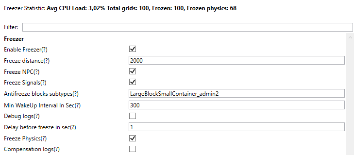

# SentisOptimisations

Плагин Torch для Space Engineers, который снимает нагрузку с сервера: заморозка гридов без игроков
(фризер), бюджеты и разнесение по кадрам тяжёлой работы (сварка проекций, заводы, буры, резаки,
генераторы, колёса, репликация, сохранение мира), сторож тяжёлой физики и тяжёлых скриптов, анти-чит и
исправления падений игры. Почти всё работает без настроек.

- [Установка](#установка)
- [Команды](#команды)
- [Настройки](#настройки)
- Нагрузка и защита: [физика](#защита-от-тяжёлой-физики), [программные блоки](#нагрузка-от-программируемых-блоков)
- [Заморозка (фризер)](#заморозка)
- [Безопасные зоны](#безопасные-зоны)
- Блоки: [сварка проекций](#сварка-проекций-без-фризов), [заводы](#очистительные-заводы-без-фризов),
  [буры](#корабельные-буры-без-фризов), [резаки](#резаки-меньше-работы-на-каждый-удар),
  [генераторы](#генераторы-o2h2-покадровый-пересчёт-раз-в-10-кадров), [колёса](#колёса-энергосистема-машины-раз-в-10-кадров),
  [прочее](#прочие-оптимизации)
- Сервер: [GC](#сборка-мусора-в-лёгких-кадрах), [сохранение мира](#сохранение-мира),
  [отправка вокселей](#отправка-планеты-подключающемуся-игроку-без-фриза), [репликация](#репликация-меньше-работы-на-кадр-при-многих-клиентах),
  [потоки Havok](#потоки-физики-havok), [игровой поток на быстрых ядрах](#игровой-поток-на-быстрых-ядрах-gamethreadcores)
- [Анти-чит](#анти-чит), [исправления падений](#исправления-падений-игры), [ошибка перевыпуска Torch](#исправление-ошибки-перевыпуска-методов-в-torch-reemitleavefix)
- [Замечания](#замечания)

## Установка

- Готовый архив плагина - на странице [Releases](https://github.com/despc/SentisOptimisations/releases): положите его
  в папку `Plugins` как есть и перезапустите Torch. Внутри плагин, `0Harmony.dll`, `manifest.xml`, лицензия.
- Релиз собирает GitHub Actions по тегу вида `1.2.3` (`.github/workflows/release.yml`); ту же сборку у себя делает
  `tools\release.ps1 -Version 1.2.3`.
- Настройки хранятся в `Instance\SentisOptimisations.cfg` и правятся в GUI Torch по вкладкам.
- В GUI показывается статистика: CPU, число замороженных гридов, время физики
  (`Physics: X.XX ms/frame`) и секция `Scripts` с самыми тяжёлыми программными блоками.
- Каждый патч регистрируется через `PatchGuard`. Если цель патча в новой версии игры исчезла, выключается
  только эта функция, а не весь сервер.

## Команды

| Команда | Кто | Что делает |
|---|---|---|
| `!set_hydro [доля]` | админ | Заполнить все водородные баки грида, на который смотрите, до доли (по умолчанию 0.5). |
| `!clean_projectors` | админ | Выключить все проекторы мира и убрать их проекции. |
| `!ai_npc clean` | админ | Удалить личности NPC-персонажей (`Shadow_Bot`, `Space_Zombie`, `Drone_Bot`, `Alien_OB`, `Mutant`), а заодно пустые фракции, репутацию и GPS удалённых личностей и владение их блоками. |

## Настройки

Пример файла со всеми параметрами и комментарием к каждому: [`SentisOptimisations.cfg.example`](SentisOptimisations.cfg.example). Его можно скопировать в `Instance\SentisOptimisations.cfg` как есть.

| Вкладка | Параметр | По умолчанию | Что делает |
|---|---|---|---|
| Freezer | `Enable Freezer` | вкл | Заморозка гридов без игроков. |
| Freezer | `Freeze distance dynamic` / `static` | 10000 / 3000 | Дальше какого расстояния от игроков динамическая или статичная группа замерзает, м. |
| Freezer | `Freeze NPC` | выкл | Замораживать NPC-гриды. |
| Freezer | `Freeze Signals` | выкл | Замораживать контейнеры-сигналы (`Container MK-…`). |
| Freezer | `Antifreeze blocks subtypes` | `LargeBlockSmallContainer_admin2:LargeBlockSmallContainer_admin` | Грид с блоком одного из этих сабтипов (через `:`) не замерзает. |
| Freezer | `Freeze Physics` | выкл | Замораживать и физику. Переключается на лету. |
| Freezer | `Min WakeUp Interval In Sec` | 600 | Как часто замороженная группа с производством просыпается для компенсации. |
| Freezer | `Delay before freeze in sec` | 5 | Задержка перед заморозкой, когда игроки ушли. |
| Freezer | `Delay before freezer start in sec` | 5 | Задержка запуска фризера после загрузки мира. |
| Logs | `Diagnostic logs` | выкл | Замеры и то, что сделали оптимизации: прогревы, время сохранения и вокселей, отложенные удаления, шаги экономики, спавн животных, а также исключения игры, перехваченные защитой от падений (`SuppressedException`: метод или проход остановился там, где бросил) и запуск `Save()` скрипта вне игрового потока. Ошибки самого плагина пишутся всегда. |
| Logs | `Freezer logs` / `Compensation logs` | выкл / выкл | Каждая заморозка и разморозка грида; итоги компенсации производства. |
| Performance | `Enable physics guard` и пороги `Physics ms to …` | вкл, 1.5 / 2 / 5 мс, 5 проверок | Сторож тяжёлой физики, см. ниже. |
| Performance | `Gas Tank Optimisation` | вкл | Баки и вентиляция переносят газ одной пачкой вместо тридцати. |
| Performance | `Safe zone grid tracking` | вкл | Безопасные зоны находят динамические гриды по геометрии, а не через физику; сварка в зоне не нагружает физику. |
| Scripts | `Enable scripts punish` | выкл | Выводить из строя слишком тяжёлые программные блоки. |
| Scripts | `Scripts max exec time` | 2 | Предел одного запуска, мс. |
| Scripts | `Scripts max ms per frame` | 0.5 | Предел среднего времени на кадр, мс; 0 — выключен. |
| Scripts | `Scripts overtime exec times before punish` | 3 | Сколько превышений нужно для наказания. |
| Welder Optimizations | `Enabled` | вкл | Оптимизированная сварка (выключено — ванильная). |
| Welder Optimizations | `Weld Projections if welded other blocks` | выкл | Разрешить в одной активации варить и обычные блоки, и проекцию. |
| Welder Optimizations | `Self Welding` | вкл | Сварщик может чинить сам себя. |
| Welder Optimizations | `Projection builds per frame` | 1 | Сколько блоков проекции сервер строит за кадр, на всех. |
| Other | `Physics threads` | 80% логических ядер | Потоки Havok, после рестарта. |
| Other | `Game thread on fast cores` | вкл | [Игровой поток на быстрых ядрах](#игровой-поток-на-быстрых-ядрах-gamethreadcores), после рестарта. |
| Other | `Enable debug logs` | выкл | Писать подавленные исключения игры в лог. |

## Возможности

### Защита от тяжёлой физики
Сторож находит группу гридов, которая грузит физику сервера, предупреждает владельца и, если нагрузка держится,
переводит группу в статику. Включён по умолчанию (`Enable physics guard`), пороги - `Physics ms to alert` (1.5),
`Physics ms to punish` (2), `Physics ms to punish immediately` (5) миллисекунд физики на кадр и
`Physics checks before punish` (5). Первую минуту после загрузки мира сторож ничего не проверяет: в это время физика
тяжёлая из-за того, что мир только встаёт на место (гриды появляются, тела просыпаются, подгружаются планеты), а не из-за
чьего-то грида.

 * **Нагрузка измеряется постоянно и даром** (`PhysicsLoadMonitor`). `MyPhysics.Simulate` - рейкасты, обслуживание
кластеров, шаг Havok по всем кластерам и очередь за ним - обрамлён двумя `Stopwatch.GetTimestamp()`, из них
считается среднее за последнюю секунду. Ни аллокаций, ни рефлексии на кадр. Раньше для этого раз в 30 секунд
поднимался сторонний плагин Profiler на 10 кадров, и его разбор к тому же выполнялся прямо в игровом потоке.
Времени по отдельному кластеру не существует: при параллельном планировании Havok (по умолчанию на выделенном
сервере) все активные кластеры идут через одну очередь задач.
 * **Разбор - только когда плохо** (`PhysicsGuard`). Пока физика укладывается в порог оповещения, проверка читает
одно число и выходит, поэтому идёт раз в 2 секунды - короткое событие вроде падающей на планете длинной
конструкции больше не проскакивает между проверками. При перегрузе один проход по активным телам всех кластеров
раскладывает измеренные миллисекунды по группам гридов.
 * **Виновник - по работе, а не по массе.** Доля группы считается по числу **активных тел и механических связей**:
это то, что Havok интегрирует, сталкивает и решает. Спящие тела не стоят ничего и не считаются, группа без
активных тел не может быть обвинена вовсе, а в знаменателе - все активные тела мира, включая персонажей, так что
группе никогда не припишут больше её доли. Прежняя версия наказывала самую тяжёлую по массе группу в самом дорогом
кластере - линкор, спокойно висящий в космосе, дешевле маленькой конструкции на полусотне роторов.
 * **Наказание** берёт механическую группу, а не физическую: пристыковавшийся коннектором или шасси чужой корабль
больше не уезжает в статику вместе с нарушителем. Счётчики нарушений протухают за 10 минут, поэтому грид, который
раз в сутки задевает порог, не накопит их за месяц; у группы есть кулдаун 10 секунд, чтобы частые проверки не
ускоряли эскалацию.

Текущее время физики видно в статистике фризера: `Physics: X.XX ms/frame (last Y.YY)`.

Так выглядят оповещения владельцу и перевод в статику:


### Нагрузка от программируемых блоков
Нагрузка каждого ПБ измеряется двумя числами, потому что они отвечают на разные вопросы: **время одного
запуска** (может ли скрипт сорвать кадр) и **время на кадр** - запуск, делённый на число кадров с прошлого
запуска. Скрипт на `Update1` по 0.8 мс стоит 0.8 мс *каждого* кадра и разовый порог не пробивает никогда,
а скрипт на `Update100` по 3 мс стоит 0.03 мс на кадр - и раньше наказывали именно второго. Оба порога в
конфиге: `Scripts max exec time` (на запуск) и `Scripts max ms per frame` (0 отключает).

Замер идёт в микросекундах (целые миллисекунды не отличают 1.9 мс каждого кадра от 1.0), а запуск, во время
которого сработала сборка мусора, выбрасывается - пауза GC не вина скрипта. Решение принимается по окну
последних 20 запусков, а не по счётчику, который только растёт: блок выводится из строя за то, что он над
бюджетом в большинстве последних запусков, а не за несколько случайных выбросов с момента загрузки мира.

Не учитываются и кадры, по которым скрипт судить нельзя: со сборкой мусора (любого поколения), во время сохранения
мира и кадры-пики (больше 33 мс и втрое дольше обычного: снимок сохранения, спавн большого грида). Замеры кадра копятся
и в конце кадра либо учитываются, либо отбрасываются целиком: запуски считаются, время нет (`FrameClock`).

Наказание делается через 30 кадров после решения и только на игровом потоке. Оно повреждает блок, и Havok пересоздаёт
его тела, а скрипт выполняется не только там, где его замеряют. Его `Save()` игра зовёт, когда собирает билдер грида,
и параллельное сохранение делало это на рабочих потоках. Наказание прямо там портило нативную память: семь падений
старого сервера 28–29.09.2026, каждое через секунды после сохранения. Запуск вне игрового потока теперь не замеряется.

В лог пишется только факт деконструирования блока; владелец получает предупреждение не чаще раза в минуту.
Постоянная картина - в GUI плагина: раскрывающаяся секция `Scripts` с суммой по всем скриптам и построчным
списком самых тяжёлых (мс на кадр, последний запуск, худший запуск, сколько из последних запусков над бюджетом).

Всё, что префикс берёт из приватных частей `MyProgrammableBlock`, связывается один раз в делегаты - раньше на
каждый запуск каждого скрипта шёл десяток `FieldInfo.GetValue` и `MethodInfo.Invoke`. Заодно исправлено:
поле `m_instance` перечитывается после `CreateInstance` (раньше терялся первый запуск после каждой компиляции),
восстановлен ванильный сброс `GridTerminalSystem` после запуска, и обёртка терминала приводится к тому
интерфейсу, который она действительно реализует.

Стенд `pb_perf` из SentisTests проверяет и замер, и наказание: шесть скриптов на `Update1` по 0.5 мс каждого
кадра (разовый порог не трогают) и два тяжёлых на `Update100`. С включённым наказанием первые выводятся из
строя мгновенно, вторые - за секунду, блок не просто выключается, а теряет функциональность.

**Компиляция скрипта вне игрового потока и в машинный код заранее** (`PbCompile`). Ванильный `Compile` ждёт компилятор
прямо в игровом потоке (`CompileIngameScriptAsync(...).Result`): Isy's Inventory Manager (100 000 символов) держал его 1,5 с
на каждой вставке, включении и перекомпиляции. А методы скрипта компилировались в машинный код при первом вызове, внутри
его запусков: 409 мс JIT в игровом потоке, запуски по 4-26 мс на старте и в первом круге каждой его задачи - PBFix
принимал это за тяжёлый скрипт и разбирал блок через 38 с после включения. Теперь компиляция идёт на рабочем потоке, там же
все методы и конструкторы сборки проходят `RuntimeHelpers.PrepareMethod`; сборка, сообщения компилятора и экземпляр
скрипта ставятся в игровом потоке, если блок жив и не перекомпилирован за это время. IIM: самый долгий кадр после
включения 23 мс, запусков дольше 2 мс за три минуты - один (было 22-24).

**Первые 10 запусков** экземпляра скрипта (после включения или перекомпиляции) не меряются: в них компилируются его
коллекции со своими типами (заранее их не подготовить) и он настраивается. Это счёт запусков, а не время: каждый запуск
обрывается лимитом инструкций игры, скрипт, тяжёлый с начала, разбирается на 14-м. Среднее на кадр начинается с запуска,
у которого известны кадры с прошлого (раньше первый запуск засчитывался как идущий каждый кадр).

**Блок больше не выключается из-за ошибок самого префикса.** Запуск вне игрового потока (`Save()` замороженного грида при
параллельном сохранении) ванильно сообщается в `MyModWatchdog.ReportIncorrectBehaviour`, который вне контекста мода падает;
PBFix ловил это и выключал блок - программники игроков гасли при сохранениях. Теперь это одна строка в лог. Запуск до того,
как у грида появилась логическая группа (грид вставляется), откладывается до следующего кадра, экземпляр создаётся заново.
Проверки: `pb_iim`, `pb_iim_watch`, `pb_save_offthread` из SentisTests.

### Заморозка
Структуры рядом с которыми нет игроков перестают обсчитываться на сервере
Если на структуре есть производственные блоки то раз в **Min WakeUp Interval In Sec** секунд структура просыпается на несколько секунд,
и заводы/сборщики компенсируют время заморозки переработывая за следующий после разморозки тик большую пачку руды или собирая большую пачку помпонентов  


 * **Freeze Physics** - Если параметр включен, то динамические структуры которые 
не закреплены об что-то статическое, в некотором смысле становятся статикой

Как это устроено: у каждого динамического грида группы (сабгриды на поршнях, роторах, шарнирах, колёса) тело
Havok переводится в Fixed (`ConvertToStatic`), сам грид статикой не становится; при разморозке тела возвращаются в
динамику. Что ваниль сама держит фиксированным, фризер не трогает и при разморозке не переделывает.

Какие группы замораживаются с физикой:
 * группа, которую ничего не держит, — целиком;
 * группа, которую держит статический грид (база со стопкой поршней, роторами, шарнирами), — тоже, если все её
   сочленения стоят: поршни упёрлись в предел или имеют скорость 0, роторы и шарниры не крутятся. Раньше такие
   группы замораживались только логикой, и сабгриды над базой оставались динамическими телами: стопка поршней,
   замёрзшая во время раскачки, качалась без игроков ещё около минуты;
 * группа со статической базой и движущимся сочленением — только логикой. Когда игрок уходит, мир Havok сразу
   перестаёт шагаться, и до ближайшего прохода фризера логика поршней успевает уехать от тел. Зафиксированная так
   стопка возвращалась с импульсами в констрейнтах около 20 млн (порог поршня 50 тыс.) и больше не ехала;
 * группа, где ваниль держит нестатический грид фиксированным (шасси на замке к статике или к грунту), — только
   логикой, как раньше: замороженные и размороженные вокруг такого шасси на планете колёса и верхушки
   возвращались со скоростью около 100 м/с.

Что поправлено (`FreezeLogic`):
 * Разморозка возвращает в динамику тело любого грида, который фризер делал Fixed, независимо от текущего
   **Freeze Physics** и от того, держит ли что-то группу сейчас. Раньше при смене одного из этих условий за время
   заморозки тело оставалось Fixed навсегда у нестатического грида. Ошибка перевода одного грида больше не
   обрывает разморозку остальных и регистрацию их логики.
 * Решение о заморозке физики принимается в игровом потоке в момент заморозки, а не в фоне за
   **Delay Before Freeze Sec** до неё. Физика замораживается только у группы целиком: грид, добавившийся в группу
   за время задержки, или группа, где часть гридов уже заморожена без физики, остаются динамикой. Раньше можно было
   получить динамический грид, прикованный констрейнтами к Fixed-телам. Если игрок пришёл во время задержки,
   заморозка отменяется (раньше грид успевал замёрзнуть на полсекунды).
 * Включение/выключение **Freeze Physics** на лету (`UpdateFreezePhysics`) больше не замораживает физику у
   проснувшихся гридов группы и не падает на удалённом гриде; ошибки перевода тел пишутся в лог.
 * Замороженное тело больше не остаётся в наборе активных тел мира Havok. Ванильный `ConvertToStatic` сам кладёт
   уже Fixed-тело в этот набор, а деактивации для Fixed-тела Havok не делает никогда. Поэтому каждый грид с
   замороженной физикой перебирался в `MyPhysics.UpdateActiveRigidBodies` каждый кадр. При 1250 замороженных гридах
   в наборе было 1292 тела, теперь 26; экономия по профилю — около 1 мс на кадр на каждые ~600 замороженных гридов.
 * Фризер согласован с ванильной настройкой мира **EnableSelectivePhysicsUpdates**. С ней мир Havok (кластер)
   шагается, только если в нём есть персонаж или что-то, что реплицируется игроку. Раньше группа могла жить
   логикой в мире, который не шагается: игрок ушёл, мир сразу встал, а заморозка пришла только через
   **Delay Before Freeze Sec**; игрок пришёл, фризер разморозил, а мир ещё не шагался, пока грид стримился
   клиенту. Поршни и моторы за это время уходили вперёд, и при возобновлении шагов констрейнты рывком
   догоняли цели: в тесте корпус улетал на 15 м со скоростью 3.5 м/с. Теперь группа размораживается, только
   когда её мир шагается, и замораживается сразу, если он не шагается. Если настройка выключена, всё работает
   как раньше.
 * Разморозка выбирает гриды на игровом потоке, как и заморозка. Раньше список собирался в фоне и мог застать
   заморозку, которая шла по гридам группы на игровом потоке, посередине. Тогда в динамику возвращалась только
   часть группы, остальные тела оставались Fixed с констрейнтами к движущимся гридам, и сабгрид отрывался (так
   было в `freezer_stress`).

Стенд `freezer_physics` из SentisTests: копии FREEZER_TEST_WITH_SUBGRIDS (шасси на шести колёсах, цепочки
поршней, шарнир, шасси зацеплено за статическую стену) на планете и в космосе, со стеной и без, плюс плита на
шасси, зацепленном за грунт. Пять циклов заморозки и разморозки (фейковый игрок уходит и приходит), затем
переключение **Freeze Physics** при замороженных гридах. Все сабгриды остаются на местах, шасси держат, повреждений
нет, никто не уходит под грунт, скорость любого грида после разморозки ≤ 0.8 м/с (порог теста 20 м/с). Подробности:
SentisTests `docs/freezer-physics.md`.

Стенд `piston_stack`: стопка из 14 поршней на статической базе в атмосфере замораживается и размораживается стоя,
во время раскачки (с физикой: 14 фиксированных тел, смещение 0) и во время движения поршней (только логикой); после
каждой разморозки стопка цела, прямая, на своей высоте и поршни ездят.

Стресс-тест `freezer_stress`: 64 копии этого грида на ровных местах по всей планете и 64 в космосе (150-300 км
над ней), каждая четвёртая на шасси, зацепленном за стену; 64 игрока стоят у половины копий и каждые 1-3 секунды
по нескольку перескакивают к свободным. 10 минут: 754 перехода, 778 заморозок и 718 разморозок (3-10 на копию),
заморожено в среднем 45% копий. Итог - 0 проблем: сабгриды 1536/1536, шасси 32/32, блоки 10272/10272, урона нет,
под грунт ничего не ушло, замороженные тела не двигались, частичной заморозки физики и "залипших" Fixed-тел нет.

### Заморозка: что ещё учитывается
 * **Что не замерзает.** Группа с блоком из **Antifreeze blocks subtypes**, NPC-гриды (без **Freeze NPC**),
контейнеры-сигналы (без **Freeze Signals**). Что фризер узнал о блоках грида (есть ли блок-антифриз, есть ли
производство для компенсации), запоминается и пересматривается, когда меняется число блоков или настройка,
или раз в 30 секунд: раньше все блоки каждой группы вдали от игроков, замороженные тоже, перебирались дважды в
секунду (Spitfire - 0.75 мс, теперь 0.0005 мс).
 * **Сборщик не списывает меньше, чем нужно.** Если сырья во входе сборщика не хватало, недостающее искалось по
остальным инвентарям грида — включая сам вход сборщика, ещё не уменьшенный: из него планировалось второе списание,
которое снимало только то, что было, а предметы выдавались целиком (дюп; поймал учёт инвентарей SentisWatcher).
Теперь вход сборщика в этот поиск не входит, берётся только из связанных конвейером инвентарей, и перед списанием
проверяется, что всё запланированное на месте, — иначе в этом проходе ничего не собирается.
 * **Компенсация производства.** Заводы и сборщики замороженного грида после разморозки отрабатывают пропущенное время
(`CompensationTracker`, `CompensationCatchUp`): пропущенное время копится и выдаётся ровно один раз, «мусорные» отметки
отбрасываются, догоняется не больше 8 часов заморозки (раньше из-за ошибки в расчёте — 8 минут). Выдаётся шагами по 20 секунд
игрового времени, по нескольку шагов за кадр (не больше 2 мс на кадр). Перед каждым шагом блок сам берёт по конвейеру то,
что понадобится ему на эти 20 секунд: завод — руду, которую успеет переработать (не больше, чтобы не обделить соседние заводы),
сборщик — компоненты под свою очередь на это время. После шага готовое выталкивается дальше, как в ванили. В каждом шаге
заводы группы идут раньше сборщиков, чтобы до сборщиков дошли слитки этого шага. Путь по конвейеру считается сразу
(после разморозки его ещё нет в кэше, а вся компенсация занимает пару кадров). Блок, простаивавший до заморозки,
сначала получает рабочее требование по питанию, и шаг ждёт, пока распределитель его подаст: иначе проход находил только
питание ожидания и не производил ничего. Выключенному блоку ничего не положено; блок без питания ждут до 10 секунд, потом
долг снимается, как и в ванили (без питания нет производства). Пока компенсация не выдана до конца,
группа не замораживается снова. С включёнными `Compensation logs` на каждую группу пишется итог: шаги, кадры, переработанная руда. Раньше блок получал все пропущенные кадры разом и за один проход перерабатывал только то,
что уже лежало в его инвентаре. Сценарий `freeze_long_production` из SentisTests (грид спит 12 минут, рядом такой же работает):
было 55% руды и 1% пластин, стало 99.9% и 98.6%, вся компенсация выдана за 2 секунды после пробуждения; `production_freezer_stress`
(64 грида, заморожены сразу после появления) — после одного пробуждения все 64 собирают очередь целиком, итог точный.
Группа с производством раз в **Min WakeUp Interval In Sec** просыпается на несколько секунд.
 * **Что делается без игроков, отдаётся при разморозке** (`FrozenProduction`). Генератор O2/H2 и кислородная
ферма получают газ, который выработали бы: не больше, чем было льда, и не больше, чем влезло бы в баки их
конвейерной сети. Грядка (`FarmPlotFreeze`) не растёт, не пьёт и не мёрзнет, пока грид заморожен (раньше росла:
её компонент обходит снятие обновлений), а при разморозке пропущенные обновления прогоняются по порядку.
 * **Лазерные антенны** (`LaserAntennaWake`). Антенна, которая тянется к другой, держит ту разбуженной, пока идёт
соединение и связь. Иначе нельзя было подключиться к своему кораблю в паре километров: его тарелка не
поворачивалась. Продлевает только конец, рядом с которым стоит игрок, поэтому две связанные антенны не держат
друг друга вечно.
 * **Замороженные блоки действительно не обновляются** (`FrozenUpdateGuard`). Блок, который меняет свои потребности в
обновлении (`NeedsUpdate`), игра тут же возвращает в списки обновлений, заморожен он или нет, а блок, у которого в кадре
заморозки висело такое возвращение, снятие с обновлений не снимало вовсе (`MyParallelEntityUpdateOrchestrator.RemoveEntity`
отменяет только отложенное добавление). Так у замороженных кораблей продолжали работать коннекторы и сенсоры. Теперь
помеченная фризером сущность в списки обновлений не попадает, а снятие делается дважды; при разморозке метка снимается
до регистрации, и блок встаёт с теми потребностями, что у него сейчас.
 * **Урон.** Замороженный грид не деформируется от ударов.
 * **Нагрузка CPU** в статистике — худший кадр за последние секунды (`CpuLoadPeak`), а не только среднее. Если
установлен SEDiscordBridge, подстановка `{cpu}` в его статусе заменяется средней нагрузкой.

Ключ группы гридов — её наименьший `EntityId` — считается как `long`. Раньше он брался через `MinBy` из VRage, который
сравнивает ключ как `float`: соседние id в нём равны, и какой грид оказывался «наименьшим», зависело от порядка обхода.
Цикл фризера (дважды в секунду по всем группам) больше не создаёт множества, LINQ-цепочки и разбор настройки
антифриза на каждую группу.

### Прочие оптимизации
Параметров нет, включены всегда.
 * **Персонажи** (`CharacterUpdate10`). Самое дорогое в персонаже — распределитель энергии скафандра и поиск
антенн в радиусе, по 37 мкс раз в 10 кадров. Теперь это реже, персонажи разнесены по кадрам.
 * **Антенны** (`AntennaUpdate10`). Каждая антенна раз в 10 кадров ищет, какие антенны достают до неё и до
каких достаёт она, — цена растёт с квадратом числа антенн рядом (256 антенн — 1.9 мс на кадр). Теперь раз в
30 кадров на гриде, который видит игрок, и раз в 100 — на гриде, который не видит никто; антенны разнесены по
кадрам. Ретрансляция (терминал, дистанционное управление, IGC) замечает новую антенну на полсекунды или
полторы позже. Включение и выключение антенны и её вещания срабатывают сразу. На стенде 128 Spitfire: 0.77 мс.
 * **Двигатели.** Двигатель без тяги больше не ищет, что жжёт его пламя (`IdleThrustDamage`): раньше каждый
работающий двигатель раз в 100 кадров бросал капсулу вдоль каждого пламени (128 Spitfire — 3.2 мс на кадр).
Длина пламени для урона бросается прямо перед проверкой, как её бросает сама игра. Десятикадровое обновление
двигателя на сервере снова выключается, как в ванили: пропуск отрисовки пламени оставлял его включённым
навсегда (0.68 мс на кадр на тех же 128 кораблях).
 * **Удаление гридов без квадратичных отписок** (`TerminalBlockClientRemoved`, `HierarchyClose`, `ConveyorEndpointClose`).
Каждый терминальный блок мира подписывался на общее событие «клиент отключился», каждый блок — на события контейнера
компонентов своего грида, каждая конвейерная точка — на событие питания конвейерной системы грида. Отписка от события
с N подписчиками копирует остальных, поэтому удаление грида стоило квадрат числа блоков, а появление — столько же.
Теперь блоки не подписываются на «клиент отключился» (одна общая подписка и короткий список блоков с открытым
редактором), а при закрытии самого грида блоки не отписываются от того, что исчезает вместе с ним. Удаление 64
производственных гридов (refinery_perf): кадр 2.75 с → 1.2 с.
 * **Сжатая копия планеты без удержания блокировки** (`VoxelBlob`). Копия для подключающихся (`VoxelStreamCache`,
`VoxelStreamAsync`) раньше собиралась через `MyStorageBase.Save`, которая сериализует и сжимает всё под разделяемой
блокировкой хранилища; бур, режущий грунт в это время, ждал в игровом потоке (кадр 459 мс, тики ботов по 300–500 мс).
Теперь под блокировкой снимаются только несжатые байты, сжатие — после, и копия отдаётся хранилищу так же, как это
делает сохранение мира (`SetDataCache` принимает её, только если хранилище за это время не менялось).
 * **Сборка мусора в фоне**: `GCSettings.LatencyMode = SustainedLowLatency` при старте — полные сборки не блокируют
игровой поток (кроме нехватки памяти).
 * **Сериализация вокселей при сохранении** (`ParallelVoxelSave`). Изменённые воксели планеты сохраняются в кадре
снимка, и пока на планете копают, игра каждый раз заново пишет все изменения в игровом потоке: на стенде с копающими
ботами это 54–171 мс из 62–173 мс кадра сохранения. Теперь листья октодерева пишутся параллельно на всех ядрах, каждая
пачка в свой буфер, и складываются в игровом порядке: те же байты, в том же кадре. Байты неизменившихся листьев берутся
из кэша (лист, версия словаря узлов, высота, значение по умолчанию). Для каждой пары «сборка плагина + сборка игры» результат
трижды сравнивается с ванильным побайтно — вне игрового потока (при фоновой пересборке копии для клиентов), и итог запоминается
в `SentisOptimisations.verified.txt` рядом с конфигом: сверка держит блокировку планеты, и бур, ждущий её, останавливал
игровой поток на 240 мс после каждого рестарта. Пока сверки нет, игровой поток пишет ванильно; при расхождении или ошибке
данные пишет сама игра. Кадр сохранения стал 16–27 мс (воксели — 12 мс на 16 МБ).
В лог на каждое сохранение пишется строка `Save snapshot` (`SaveTiming`): сколько ушло на чекпоинт, сущности и воксели,
и сколько изменённых хранилищ записано целиком.
 * **Буферы для записи хранилищ целиком** (`VoxelBuffers`). Сохранение мира и копия для клиентов пишут раскапываемую
планету целиком снова и снова; игра пишет в `MemoryStream`, который растёт с 16 КБ удвоениями, и копирует результат:
на 16 МБ хранилища — около 50 МБ больших массивов мусора за раз. Большие массивы собирает только полная сборка, и сервер
делал её раз в минуту (17 gen2 за 15 минут, кадры до 50 мс). Теперь запись идёт в буферы из небольшого пула, сжатие —
тоже, новой памятью становится только результат; фоновая копия для клиентов не получает даже несжатого массива.
Байты — игровые (тот же заголовок, тот же `SaveInternal`), первые записи сверяются с ванильными так же, как выше.
Полных сборок стало одна-две за 10 минут.
 * **Ожидание фоновой инициализации сущностей** (`EntityInitDrain`). Сущность, созданная в фоне (руда из
каждого бура, выброшенные предметы, появившиеся гриды), перед следующим параллельным обновлением сущностей
дожидается игровым потоком через `SpinWait.SpinUntil`, который время от времени делает `Thread.Sleep(1)`, а
Windows будит такой сон через тик таймера — 15,6 мс. Инициализация на доли миллисекунды стоила кадру 15 мс: пока
кто-то бурит, кадр 20 мс каждые несколько секунд. Теперь ожидание только крутится и уступает ядро
(`Thread.Yield`, `Thread.Sleep(0)`) и кончается вместе с работой.
 * **Работа для экрана, которого у сервера нет** (`ParallelUpdateTweaks`, `ServerGridRender`). Не обновляются
позиционный звук, пламя двигателей (флаг, который его просит, всё равно сбрасывается), анимация головы и оружия персонажа. Не перестраиваются ячейки рендера
гридов после каждой сварки и удара: на сварочном стенде это была четверть стоимости сварки и кадры 18–20 мс.
Первая перестройка ячейки всё же проходит: только она даёт ячейке объект отсечения, а к нему турели и другие блоки
с подвижными частями привязывают свои подчасти. Без него `MyLargeTurretBase.RotateModels` на сервере не поворачивал
ствол вовсе: прицел, проверка видимости и пули оставались там, куда турель смотрела при установке, — турели били по
своей базе и по игрокам рядом и ни разу по волку (стенд и прод, 04.10.2026; сценарии `turret_wolf`, `turret_wolves`).
Не перекрашиваются светящиеся части подчастей блоков (`MyEntity.SetEmissivePartsForSubparts`): водородный двигатель
делает это каждый кадр из обновления ёмкости, на старом сервере 0,4 с из 120.
Скрипты модов не обвешиваются счётчиками профайлера.
 * **Поршни** (`PistonUpdate`). Поршень, упёршийся в предел, и поршень с нулевой скоростью не будят тела и не
пересчитывают констрейнты каждый кадр — ваниль в этих кадрах всё равно ничего не меняет.
 * **Баки и вентиляция** (`GasTankOptimisations`, **Gas Tank Optimisation**). Газ переносится одной пачкой на
тридцать обновлений, проход по конвейерной сети один, а не тридцать. Удержанный газ никогда не теряется: блок,
остановившийся посреди пачки, получает её целиком.
 * **Выдача мира подключающемуся игроку** (`ReplicableAddBudget`). Сущности,
которые получает новый клиент, выдаются по кадрам в пределах 4 мс на кадр, а не все в одном кадре на сотни мс.
 * **Персонаж на грунте** (`CharacterContactParticles`, `CharacterStepMaterial`). Каждый контакт персонажа с вокселями
создавал замыкание, делегат и вызов в очереди игрового потока ради пыли под ногами, а для следов и звука шагов читал материал
грунта из хранилища под его блокировкой. Выделенный сервер не рисует и не звучит: теперь замыкание одно на поток, частицы
не ставятся в очередь, материал для следов (`ProcessTrails` на сервере всё равно выходит сразу) и для звука шагов не читается.
Урон от удара и опора под ногами (прыжок) — игровые, без изменений.
 * **Сдвинувшиеся сущности для дерева поиска** (`PruningMovedList`). Каждая сдвинувшаяся сущность каждый кадр попадала в
`ConcurrentBag` (новый узел на запись), а раз в кадр обход мешка копировал его в новый массив. Теперь два переиспользуемых
списка под блокировкой; сдвиг во время обхода не теряется, а ждёт следующего кадра.
 * **Список игроков онлайн** (`OnlinePlayersSnapshot`). `GetOnlinePlayers` — это `Values` у `ConcurrentDictionary`: все
блокировки словаря и новая копия на каждый вызов, а игра зовёт его в шестидесяти местах по нескольку раз за кадр. Теперь
копия хранится до изменения списка (три метода, которые добавляют, удаляют и очищают игроков, повышают версию).
 * **Лимиты блоков** (`BlockLimitsWalk`). Каждый кадр для каждого игрока онлайн игра ищет изменившиеся лимиты по типам
блоков и по гридам через `Values` двух `ConcurrentDictionary` — все блокировки и копия. Теперь обход идёт по словарю
как есть, без блокировок и копий.
 * **Процедурные астероиды по кадрам** (`AsteroidGenerationBudget`). Игрок, прыгнувший или залетевший туда, где никого
не было, получал все астероиды новых ячеек в одном кадре: 50–140 мс на прыжок (стенд `procedural_jump`), секунды, когда
на новые места прибывают многие. Теперь они создаются игровым же методом по одному, в пределах 3 мс на кадр (не меньше
одного за кадр); астероид, ячейку которого генератор уже отпустил, не создаётся.
 * **Цены префабов в экономике** (`PrefabPriceOnce`). Раз в тик экономики (по умолчанию каждые 10–20 минут) игра создаёт
контракты для всех станций и для каждого считает цену и PCU корабля контракта (`MyMinimalPriceCalculator.CalculatePrefabInformation`):
каждый раз заново читает префаб с диска, проходит все его блоки и выгружает его, хотя посчитанное уже лежит в калькуляторе.
На стенде это кадр 0,4–0,6 с каждый тик экономики. Теперь префаб, уже посчитанный тем же калькулятором с тем же множителем
цены, в расчёт не идёт; результат — тот же, что посчитала игра.
 * **Плавающие объекты в земле** (`FloatingInVoxelCheck`). Игра каждый кадр берёт один плавающий объект и читает
воксели в 8 углах его коробки, чтобы удалить застрявшие в земле: 0,15 мс на каждый кадр, сколько бы объектов ни было.
Теперь проверка идёт раз в 4 кадра; застрявший объект удаляется на несколько десятков кадров позже.
 * **Пути животных по навмешу** (`NavmeshObbLookup`). Волк дважды в секунду ищет путь до каждого игрока рядом и
место, куда пойти, и для каждого пути игра проверяет отрезок против всех тайлов навмеша, каждый раз строя матрицу
поворота тайла. Теперь сначала отбрасываются тайлы, от центра которых отрезок дальше их полудиагонали (он не может
ни кончиться в них, ни пересечь их), остальные проверяются игрой; результат тот же.
 * **Кэш вокселей навмеша** (`NavmeshCacheInvalidation`). Каждое изменение вокселей рядом с навмешем животных (бур,
резак по земле) ставит изменённую область в очередь, и перед постройкой следующего тайла (на фоновом потоке
ParallelTasks) игра чистит кэш мешей: для каждой области перебирает кэш через `ElementAt(i)`, а `ElementAt` у словаря
каждый раз идёт с начала — квадрат размера кэша на одну область. Кэш за время работы сервера только растёт. На проде
(Timeline dotTrace, 04.10.2026) это занимало фоновый поток на 97,8%: 2,84 с из 2,9 с. Теперь один проход по кэшу на
область, результат тот же до ячейки: удаляется первая по порядку словаря ячейка в области, и только она (так делает
игра; остальные ячейки большой области остаются в кэше, как и раньше). Проверка — `NavmeshCacheInvalidationTests`:
те же удаления, что у игры, на случайных кэшах; 20 000 ячеек и 30 областей — меньше 200 мс.
 * **Тик экономики по кадрам** (`EconomySpread`). Раз в тик экономики игра проходит все фракции в одном кадре: баланс,
станции с их контрактами, ассортимент магазинов — 50 мс кадра на стенде даже с `PrefabPriceOnce`. Теперь тик только
готовится (старые контракты убраны, контракты станций посчитаны, фракции собраны в очередь — как игра делает сначала),
а дальше каждый кадр делает один шаг: баланс фракции, одну станцию или магазины фракции, теми же методами игры и в том
же порядке. На стенде 96 шагов за 96 кадров, самый долгий обычно 4–5 мс.
 * **Память для игры с фонового потока** (`GcMemoryCached`). Игра спрашивает `GC.GetTotalMemory` (строка «GC Memory»
раз в 30 с, окно Torch), а при серверном GC этот вызов ждёт замок сборщика: 10–12 мс кадра, когда идёт фоновая сборка.
Теперь значение раз в секунду читает таймер, игра получает последнее.
 * **Удаление сущностей в пределах кадра** (`EntityDeleteBudget`). В конце кадра игра удаляет всё, что закрылось за
кадр: уход глобальной встречи (десяток гридов, 2400 блоков) был 67 мс одного кадра. Теперь в этом вызове удаление идёт
4 мс (хотя бы одна сущность), остальное ждёт в том же наборе, куда игра сама откладывает закреплённые сущности, —
закрыто уже, только убрано на кадр-другой позже. Любой другой вызов (поток создания сущностей, выгрузка) — как в игре.
 * **Удаление из списков обновления одним проходом** (`UpdateListBulkRemoval`). Сущности, которые обновляются раз в 10
и раз в 100 кадров, лежат в `TypeSortedCachingList<MyEntity>`: один список, сгруппированный по типам, и индекс конца
каждой группы. Удалённые ждут до `ApplyRemovals`, а там каждую убирает `List.Remove` — поиск по всему списку. Удаление
многих гридов разом квадратично: после 500 кораблей `load_test_500` (1,4 млн блоков) игровой поток простоял в нём
дольше 60 с, и сторож Torch убил сервер (30.09.2026). Теперь, если ждут 16 удалений и больше, список пересобирается
за один проход: убирается первое вхождение каждого удаляемого, как у `List.Remove`, а конец каждой группы сдвигается на
число убранных из неё и из групп перед ней. Результат тот же, что у игры (тест сверяет с её `ApplyRemovals`). Патч
Harmony: цель — метод обобщённого класса.
 * **Список точек возрождения** (`RespawnPointsCache`). Игрок в окне возрождения раз в 10 с запрашивает список точек, и
для каждой сервер физикой проверяет, поместится ли персонаж: 7–29 мс кадра на десять точек. Теперь ответ по точке берётся
из проверенного не больше минуты назад, недавно запрошенные точки перепроверяются в фоне по одной. Непроверенные точки
запрос проверяет сам только первые 3 мс; остальные показываются доступными и проверяются в следующих кадрах по одной, а
если какая-то оказалась занята, игроку сразу уходит исправленный список. Само возрождение проверяет место заново, как
раньше.
 * **Ячейки станций экономики** (`StationCellIndex`). При возрождении в капсуле игра ищет станцию в радиусе 150 км
(для датапада в кресле) и генерирует для этого процедурные ячейки станций — на стенде 2349 ячеек, каждая перебирает все
станции всех фракций: 14,9 мс из 21,7 мс посадки в кресло. Теперь ячейки, где есть станция, известны из набора,
который собирается не чаще раза в кадр; ячейка без станции сразу пустая (ровно так её оставила бы игра), ячейку со
станцией делает сама игра.
 * **Детектор реверберации персонажей** (`ReverbDetectorOff`). Каждый персонаж каждый кадр пускает луч, чтобы понять,
насколько он в замкнутом месте, — для звука локального игрока; все читатели этого результата спрашивают его у
`LocalCharacter`, которого на выделенном сервере нет. Один такой вызов у только что возродившегося игрока занял 68,8 мс.
На выделенном сервере детектор теперь не работает.
 * **Спавн диких животных** (`FaunaSpawnPrefetch`). Игра выбирает точку в сотне метров от игрока и ищет там место
(`FindFreePlace`), а физических форм этой земли ещё нет — физика строит их прямо в кадре: 5–17 мс на спавн. Теперь
точка выбирается так же, формы земли вокруг неё заказываются в фоне (`PrefetchShapeOnRay`, сетка 3×3 лучей), а через
30 кадров выполняется остальная часть игрового спавна — лимит ботов, место, поправка точки, вид животного, настройки
мира. Место теперь находится за 0,2–2,6 мс. Стая, которую игра спавнит разом (три волка — кадр 45 мс), идёт по одному
животному за кадр.
 * **Компиляция кода плагинов в фоне** (`PluginJitWarmup`). Сборки игры — готовые машинные образы (NGen), а плагины —
IL, и каждый их метод компилируется JIT при первом вызове, прямо в кадре: большие методы ботов стоили 10–20 мс в первый
раз после каждого старта. Теперь после загрузки мира отдельный поток с низким приоритетом один раз компилирует все
методы сборок плагинов (на стенде 12 346 методов за 2,6 с); уже скомпилированные и пропатченные методы не трогаются.
 * **Программные блоки** (`PBFix`). Владение гридом пересчитывается, только когда оно изменилось, а не на каждый
запуск каждого скрипта.
 * **Компиляция скриптов** программных блоков идёт с оптимизацией (Release, без отладочной информации) (`CrashFixPatch`).
 * **Защита вокселей.** Если на сервере есть мод NanoBotSuppressor, вырезание вокселей (буры, взрывы, ломающиеся
гриды) не действует в зоне его модулей.

### Выход игрока: очистка репликации без зависания
Ванильный `MyReplicationServer.RemoveClient` чистит репликацию вышедшего клиента циклом "пока список не пуст -
удалить первый". Объект, которого уже нет в `m_replicableGroups`, из списка клиента не удаляется, и цикл
становится вечным - сервер зависает на выходе игрока. Патч (`CrashFixPatch.RemoveClientPatch`) проходит по
копии списка один раз, каждый объект в своём try, а клиента удаляет в `finally`, что бы ни случилось (иначе
`OnClientLeft` крутил бы свой цикл вечно). В лог пишется одно предупреждение, только если что-то осталось в списке
или очистка заняла больше 16 мс; обычный выход игрока (до 1000 объектов) - 0-4 мс, ~4.5 мкс на объект.

### Потоки физики (Havok)
Параметр **Physics threads** на вкладке Other задаёт, на скольких рабочих потоках Havok считает шаг физики.
В ванили число выбирает сам Havok: 7 потоков на 16-поточном процессоре. По умолчанию здесь 80% логических
потоков процессора. Значение применяется после перезапуска: `MyPhysics.LoadData` создаёт пул один раз при загрузке
мира, а патч подставляет число из конфига в `OptimalHavokThreadCount`, откуда оно берётся. В лог пишется
`Havok threads: 13`. На лету пул не подменяется: лишние пулы, созданные во время работы мира, роняли Havok.

Прирост быстро упирается в потолок: остров (связанные тела, например корабль со всеми сабгридами) решается целиком
одним потоком, а подготовка каждого мира и колбэки контактов идут последовательно. На колёсном стенде 1 поток давал
15.5 мс физики на кадр, 7 потоков — 6.3 мс, 15 потоков — 5.6 мс. Больше, чем физических ядер, ставить смысла мало:
лишние потоки мешают сборщику мусора, репликации и фоновым циклам.

### Игровой поток на быстрых ядрах (`GameThreadCores`)
На гибридном процессоре (Intel 12-го поколения и новее) Windows гоняет игровой поток и по E-ядрам, которые
заметно медленнее, и по P-ядрам, которые разгоняются ниже «любимых» (favored; на i7-13700K это логические 8–11).
На первом кадре поток привязывается через CPU sets (`SetThreadSelectedCpuSets`) к P-ядрам высшего класса
планирования: не меньше двух физических ядер, по одному логическому на каждое, потому что второй поток того же ядра
делил бы его с соседом. На i7-13700K это логические 8 и 10, в лог пишется
`Game thread on logical processors 8, 10 of 24`. Процессор с одинаковыми ядрами не трогается. Остальные потоки
(Havok, GC, сеть) не ограничиваются и могут работать на тех же ядрах. Выключается настройкой
**Game thread on fast cores** на вкладке Other (в лог пишется `Game thread left to Windows`). Привязка делается один
раз, поэтому изменение действует после перезапуска.

### Физика там, где никого нет (`SelectivePhysicsBodies`)
С настройкой мира `EnableSelectivePhysicsUpdates` выделенный сервер шагает Havok только в тех кластерах, где есть
персонаж или сущность, реплицируемая какому-нибудь клиенту. Остальные кластеры стоят. Патч доводит это до конца.

- **Обход тел после шага.** `MyPhysics.UpdateActiveRigidBodies` в ванили обходил активные тела всех кластеров: каждому
  гриду заново ставил матрицу со всеми подписчиками, считал ускорения и место в дереве кластеров. Нешагаемый мир
  свои тела никогда не усыпляет, поэтому всё, что двигалось при уходе последнего игрока, оставалось в обходе навсегда.
  На большом мире без игроков это ~1000 гридов каждый кадр, 20 с из 150 с в профиле. Теперь обход берёт только
  шагаемые кластеры. На старом сервере физика упала с 7,3 до 4,1 мс на кадр, скорость симуляции выросла с 0,74 до 0,85.
- **Силы.** Сила или импульс (тяга, гироскопы, привод колёс; `MyPhysicsBody.AddForceInternal`) сразу меняют
  скорость тела в Havok, а в движение её превращает только шаг. В нешагаемом кластере скорость просто копилась:
  брошенный на ходу ровер набирал 50–90 м/с стоя на месте и улетал на первом шаге после прихода игрока. Висящий на
  двигателях корабль набирал 5 м/с. Это было и в ванили. Теперь силы в нешагаемом кластере не прикладываются.
- **Привод колёс.** `MyMotorSuspension.Accelerate` крутит колесо своим импульсом, мимо `AddForce`. Колесо стоящего
  ровера раскручивалось до предела скорости и на возвращении хватало землю с рывком 9–12 м/с. Теперь привод в
  нешагаемом кластере ждёт.
- **Поршни.** Логика поршня (`MyPistonBase.UpdatePosition`) каждый кадр двигает цель головы на скорость/60 независимо
  от физики. Без шага голова стояла, а цель уезжала до предела. На первом шаге решатель рывком тянул все головы
  стопки, 22 м/с, и отрывал поршни. Теперь в нешагаемом кластере поршень цель не двигает.

- **Тяга, коннекторы, сенсоры.** Компонент тяги грида каждый кадр на параллельных обновлениях пересчитывает тягу по
  направлениям, демпферы, энергию и топливо (`MyThrusterBlockThrustComponent`) и снимает себя с обновления, только когда
  тяга нулевая, то есть никогда у корабля, висящего на двигателях. Коннектор каждые 40 кадров ищет, с кем сцепиться
  (`MyShipConnector.TryAttach`), сенсор каждые 10 кадров опрашивает дерево и Havok (`MySensorBlock.UpdateAfterSimulation10`).
  Там, где ничто не движется, всё это работа впустую: на старом сервере без игроков тяга была 26 с из 64 с параллельных
  обновлений. Теперь в нешагаемом кластере они ждут и продолжают с первого шагаемого кадра. Средний кадр старого сервера
  без игроков упал с 15,4–15,6 до 12,7 мс. Проверка: сценарий `unstepped_blocks` (без игрока коннекторы не находят друг
  друга, с игроком через 0,5 с кластер шагает, сенсор видит игрока, коннекторы сцепляются).
- **Раскачка поршневых стопок** (`PistonUpdate`) там же не гасится: раскачиваться нечему, а тела в нешагаемом мире не
  засыпают, и проверка каждый раз находила стопку «проснувшейся».
- **Проверка отрыва.** Ротор, шарнир, поршень и подвеска каждый кадр мерят, насколько верх ушёл от места, чтобы
  оторваться за пределом (`CheckSafetyDetach`, 1,2 с из 120 на старом сервере): где ничто не движется, ничто и не уходит.
  Блок без констрейнта остаётся игре (тот же метод снимает его с покадровых обновлений). Гироскопы не пропускаются:
  пропущенные, пока кластер стоял, они на первом шагаемом кадре бросили сабгрид рига `freezer_physics` со скоростью 87 м/с.

Проверка: сценарий SentisTests `physics_resume`. Риги с сабгридами на временной планете и в космосе в движении:
шасси на колёсах (на статике, свободное, едущее), стопка из 14 поршней, корабль на двигателях в гравитации, летящий
корабль. Игроки уходят и возвращаются три раза. Сценарий проверяет, что кластер действительно не шагается, что скорость
не копится, что в первую секунду после возвращения нет рывков и что ничего не оторвалось и не повредилось.

### Безопасные зоны
Зона узнаёт, что в ней находится, от физического «фантома»: Havok сообщает ей, когда тело начинает и перестаёт
её касаться. Динамический грид, который варят или режут внутри зоны, почти каждый кадр меняет форму - блоки
проходят стадии постройки, - и для Havok это каждый раз новая форма: он заново строит её контакты с зоной, по
одному на каждую часть, и сообщает зоне, что грид вышел и снова вошёл. Корабль из 2757 блоков, который сваривали
по проекции внутри зоны, давал 600-900 таких пар каждый кадр; почти вся эта цена - внутри Havok, отвечать на
события быстрее в коде игры пробовали, кадр быстрее не стал.

**Safe zone grid tracking** (`SafeZoneGridTracking`, по умолчанию вкл). Фантом зоны ставится на отдельный слой
коллизий (1 - в игре на нём ничего нет), настроенный как слой динамических гридов, но без столкновений с гридами:
персонажей, выпавшие предметы, ракеты и метеориты зона по-прежнему видит через фантом, а гриды - нет. Статичные
гриды фантом не видел и раньше, игра вносит их в зону по геометрии. Динамические гриды плагин ищет сам: каждая зона
раз в 10 кадров берёт гриды рядом с собой и сравнивает их коробку со своей формой. Грид целиком внутри - вносится
в зону, грид поперёк границы - вносится, если его форма заходит в зону (та же проверка форм, что у игры; для уже
внесённого повторяется раз в секунду), грид, ушедший от зоны или из мира, - выносится. Внос и вынос делают методы
самой игры, поэтому блокировка моторов, пилоты и клиенты работают как раньше.

Разница с игрой: зона замечает въехавший динамический грид не сразу, а в течение 10 кадров (1/6 секунды).

Замеры (SentisTests, сварка Spitfire по проекции на динамической платформе, 172 с):

| | физика, мс/кадр | работа кадра, мс |
|---|---|---|
| без зоны (`welder_perf_dynamic`) | 1.09 | 3.24 |
| в зоне, трекинг плагина (`welder_perf_sz_dynamic_noprobe`) | 1.16-1.23 | 3.38-3.54 |
| в зоне, как в игре (`welder_perf_sz_dynamic_vanilla`) | 1.86-1.98 | 4.14-4.43 |

Само отслеживание стоит около 0.01 мс на кадр. `safezone_border`: зона ловит каждый вход чужого корабля (в прогоне - за 1-2
кадра) и каждый выход, блокировка моторов переключается ровно один раз на переход
(в игре - с дребезгом, 74 переключения на 40 переходов).

Защита от урона не зависит от задержки: урон от столкновения игра проверяет по месту удара, а не по списку зоны.
`safezone_ram`: корабль с пилотом на 100 м/с таранит статичную плиту в зоне без урона - ни плита, ни корабль не
повреждены; тот же таран вне зоны разбивает оба. Клиентам уходят те же события «вошёл/вышел» для грида, что и в
игре. Подробности - `docs/safezone-perf.md` в SentisTests.

Флаг действует на зоны, созданные или перестроенные после его изменения; на все зоны - после перезапуска сервера.
Зона, у которой фантом уже на слое 1, отслеживается плагином, пока не перестроится.

Прежние параметры **Safe zone subgrid optimisation** и **Safe zone Physics Threshold** удалены. Игра сама считает
грид защищённым по всей механической группе, а замена плагина была медленнее и пускала в зону грид из чёрного
списка, прицепленный к защищённому. Защита от «DDoS» сваркой в зоне мерила только постановку проверки выхода в
очередь, а не саму работу, и ни разу не срабатывала.

### Сварка проекций без фризов
Сварка целиком выполняется в игровом потоке: мутации блоков, конвейеры и Havok небезопасно трогать из воркеров.
Прежний параметр **Async weld** удалён. Вместо переноса в потоки работа сварщиков по проекции ограничена бюджетом на кадр:

 * **Projection builds per frame** (по умолчанию `1`, минимум `1`) - сколько блоков проекции может материализовать
весь сервер за один кадр симуляции. Лимит общий для всех сварщиков: право строить передаётся между ними по кругу,
поэтому несколько сварщиков в одном кадре не складывают свои `Projector.Build` в один длинный кадр.
 * **Инкрементальный поиск** - одна активация сварщика делает не больше 24 новых проверок `CanBuild`
(константа в коде, настройки нет). Вместо ванильного полного скана голограммы на каждой активации
проверяется небольшой кусок, курсор продолжает с того же места в следующий раз, а соседи только что
построенного блока проверяются первыми.

**Projection builds per frame** меняется на лету. Множитель радиуса сварщика (плагин SentisGameplayImprovements, `toolradius welder`)
не имеет верхнего предела, минимум `0.1`.

Активация инструмента (сварщик, резак, бур) - ванильная, плагин её не трогает. Раньше `ActivateCommon` заменялся копией времён переноса сварки в потоки, и в игровом потоке
копия только проигрывала: искала сущности перебором кэша наблюдателя, который на каждой активации копировал
**все гриды, персонажей и воксели мира** (`ConcurrentDictionary.Keys`), создавала новые коллекции и ходила в поля
инструмента через рефлексию с упаковкой. 220 включённых сварщиков, которым нечего варить, давали 401 МБ мусора
в минуту - 45% всего, что выделял игровой поток в тесте репликации; теперь 1 МБ. Ванильная версия ищет через
`MyGamePruningStructure` в общий список и почти ничего не выделяет. Заодно убрана копия `GetBlocksInsideSpheres`,
после которой ванильный метод всё равно выполнялся ещё раз.

Почему так: профиль dotTrace на 3 сварщиках показал, что время уходит не на сам `Build`
(в среднем ~0.5 мс), а на ванильный поиск строящихся блоков: `FindProjectedBlocks` + `CanBuild` +
`TestPlacementAreaCube` суммарно ~25 с CPU за 90 с сварки, и весь скан выполнялся в одном кадре.

Результат (стенд `welder_perf` из SentisTests: 3 сварщика, проекция 10×10×10 из тяжёлой брони, 1000 блоков,
время работы кадра симуляции без сна до 60 Гц):

| | avg | p99 | p99.9 | max | кадров > 16.7 мс |
|---|---|---|---|---|---|
| прогретый сервер | ~1.1 мс | ~4 мс | 6-8 мс | 10-13 мс | **0** из 7470 |

Самый долгий `Projector.Build` на прогретом сервере 2-6 мс, самые тяжёлые кадры сварки 8-10 мс (совпадают с GC).
Единственный оставшийся пик от сварки - **первый `Build` после рестарта сервера (24-36 мс, один раз)**: холодный путь (JIT или первая загрузка модели блока),
причина не подтверждена. Подробности замеров и методика: `docs/welder-perf.md` в репозитории SentisTests.

### Очистительные заводы без фризов
Все изменения выполняются в игровом потоке. Общий объём переработки не уменьшается, а сама переработка идёт быстрее ванили.

 * **Разнесение таймеров.** Ванильный таймер производственного блока
срабатывает раз в 60 кадров. Блоки, созданные одновременно (загрузка мира, спавн, вставка), срабатывают в одном и том же кадре,
и на большой базе это давало кадры 50-77 мс. Каждому таймеру назначается случайная фаза, и работа заводов равномерно распределяется по кадрам.
Действует при создании блока (загрузка мира, спавн, вставка); касается и сборщиков. Параметров нет.
 * **Добор руды до своей доли** вместо ванильного 30%/60%. Ваниль тянет по 2000 кг, пока вход не заполнен на 60%, поэтому первые заводы
забирают руду, а остальные простаивают. Доля завода - вся руда сети (контейнеры плюс входы всех включённых работающих заводов),
делённая на число таких заводов. Завод добирает до доли; доборы меньше 500 кг пропускаются, почти пустой завод (<100 кг) всегда получает руду.
 * **Бюджет доборов:** не больше 30 доборов руды за кадр на весь сервер, первыми обслуживаются самые пустые заводы.
 * **Пустая сеть:** если в сети нет руды, завод не сканирует её каждую секунду, а ждёт 2, 4, 8... до 10 с (с разбросом по заводам).
Как только руда появляется в любом отдающем инвентаре сети (контейнер, коннектор, бур) или меняется граф конвейеров, ожидание сразу отменяется.
 * **Проверка «есть ли в сети руда»** после пустого добора запоминается по сети до следующего поступления руды или
перестройки конвейеров. Раньше каждый завод в сети без руды обходил все блоки, инвентари и предметы сети, чтобы
найти то же «ничего»: при 6464 заводах это сотни полных обходов в секунду. В тесте репликации тики заводов
стали дешевле на четверть (1.18 → 0.87 мс на кадр).

### Корабельные буры без фризов
Все изменения выполняются в игровом потоке и касаются корабельных буров, ручной дрели и взрывов (вырезание у них одно);
воксельные руки, заливка и команды администратора идут как в ванили. Параметров нет.

Ручная дрель режет породу раз в секунду, и каждый раз следующий шаг физики синхронно строил ячейки, в которых стоит
персонаж и куда смотрят лучи сенсора дрели: шаг физики 7–12 мс раз в секунду, пока кто-то копает. Её вырезание
(уведомление, которое `MyVoxelGenerator.CutOutShapeWithProperties` ставит в игровой поток) обрабатывается так же,
как вырезание корабельного бура ниже; на стенде кадров, где физика дольше 8 мс, стало 5 вместо 80 за 10 минут.

 * **Коллизия вокселей после вырезания строится в фоне** (`DrillCutPhysics`). Вырезание бура заканчивается тем,
что хранилище вокселей сообщает об изменённом диапазоне, а тело физики вокселей выбрасывает все ячейки коллизии
(кубы 8 м) этого диапазона из формы Havok и запускает фоновые задания, которые строят их заново. Корабль касается
именно этих ячеек, поэтому следующий же шаг физики запрашивает их раньше, чем задания готовы, и Havok строит их
синхронно (dual contouring плюс материалы планеты) - игровой поток ждёт. Три изменения:
   * диапазон, о котором сообщает хранилище, выровнен по чанкам 16 вокселей, и большая часть его ячеек не меняется.
Ячейка теперь трогается, только если её задела сфера какого-то бура (с запасом на то, что меш ячейки читает
соседние воксели); на стенде это 456 тыс. из 585 тыс. ячеек;
   * ячейка, где уже есть поверхность, сохраняет старую форму, пока фоновое задание не построит новую. Бур только
убирает породу, поэтому старая поверхность ограничивает меньше пустоты, чем новая: несколько кадров корабль может
стоять на уже выбранной породе, но не может провалиться в ещё целую. Ячейка без поверхности, где после вырезания
по-прежнему только воздух или только порода, не трогается. Ячейка, где поверхность появилась впервые (бур вошёл
в сплошную породу), обрабатывается как в ванили: пустая старая ячейка пропустила бы корабль сквозь породу;
   * готовое фоновое задание в ванили сразу ставит ячейку в форму и помечает тело на `HkRigidBody.UpdateShape`
(несколько миллисекунд для участка планеты). Когда задания завершаются по одному, это обновление почти каждый кадр.
Готовые меши сохранённых ячеек держатся со своей ссылкой до ближайшего 10-кадрового обновления тела, которое
ставит их все и помечает тело один раз - те же два шага, что в ванили, пачкой;
 * **Результаты вырезания только по вырезанным материалам** (`DrillCutoutResults`). Ваниль на каждый бур создаёт
словарь со всеми материалами вокселей игры (~60), почти все с нулём, и для каждого материала с рудой создаёт
object builder руды и вызывает `AddItems`, который для нуля сразу возвращается. На стенде это 5.4 млн вызовов
`AddItems` и ~1 ГБ мусора за две минуты. Теперь словарь один и переиспользуется, в нём только ненулевые материалы.
Пропадают только ненужные нули: пустой object builder, ключ с нулём в статистике добычи сессии и событие
визуальных скриптов `ShipDrillCollected` с количеством 0;
 * **Покадровое обновление бура раз в 10 кадров** (`DrillFrameUpdate`). `MyShipDrill.UpdateAfterSimulation` идёт
каждый кадр у каждого включённого бура, а на выделенном сервере от него нужны только время анимации (оно считается
по часам), сила тряски (только с включённой в мире тряской инструментов, по умолчанию выключена) и статистика
времени добычи у пилота - при этом каждый кадр проверяются доступ, безопасные зоны и питание. Буры корабля,
которым кто-то управляет, и миры с тряской остаются на ванильном обновлении. Само бурение (срез раз в 90 кадров)
идёт в другом обновлении и не меняется.
 * **Сенсор и сфера вырезания бура догоняют корабль лениво** (тоже `DrillFrameUpdate`). Каждое движение корабля
заставляло каждый его бур пересчитать мировую матрицу, сенсор и сферу вырезания - у бурящего корабля это каждый
кадр. Теперь бур только помечается, а позиция обновляется перед каждым, кто её читает: бурение, `CanShoot`,
выдача руды, покадровое обновление и чтение публичного `DrillBase`.

Результат на стенде `drill_perf` из SentisTests (32 корабля DRILL_TEST по 36 больших буров, бурят планету;
стенд играет роль двигателей и давит вниз с ограниченной силой), время работы кадра симуляции:

| | средний кадр | p99 | max | кадров > 16.7 мс | > 33.3 мс | мусор за 2 мин |
|---|---|---|---|---|---|---|
| ваниль | 16.2 мс | 53.5 мс | 82.8 мс | 1541 | 721 | 2.1 ГБ |
| с исправлениями | **8.9 мс** | **15.6 мс** | 32.6 мс\* | **15** | **0** | 1.25 ГБ |

\* Кадр самого стенда (`harness` 20 мс): раз в 10 секунд он пересчитывает руду во всех инвентарях.
Подробности и все замеры: `docs/drill-perf.md` в репозитории SentisTests.

### Резаки: меньше работы на каждый удар
Все изменения касаются только серверной части и выполняются в игровом потоке; сама скорость распила, выдача
компонентов и разрушение блоков - как в ванили. Параметров нет.

 * **Анимация лезвий не гоняется на выделенном сервере** (`GrinderPatches`). Резак срабатывает не чаще раза
в 250 мс, а его `UpdateAfterSimulation10` приходит каждые ~167 мс, поэтому каждый второй вызов видел
включённый троттлинг и останавливал анимацию, а следующий запускал её снова - вызов рендера на каждое лезвие
каждого резака раз в 10 кадров на сервере, у которого рендера нет. На стенде это 216 тыс. вызовов за две минуты;
 * **Синхронизация блока не чаще раза в 15 кадров** (тоже `GrinderPatches`). Каждый удар по блоку рассылал
всем клиентам событие целостности (`SendIntegrityChanged`) и одно-два события склада компонентов
(`SendStockpileChanged`). Теперь блок, который пилят, варят или ломают, отправляет не чаще раза в 15 кадров:
целостность - с последним значением, изменения склада - суммой. Начало и конец стройки или разбора уходят сразу
(после всего накопленного), а накопленное для блока, которого уже нет на своём месте, выбрасывается. На стенде
число пакетов склада на блок упало в 4.6 раза, целостности - в 1.6 раза;
 * **Модели стадий постройки грузятся в фоне** (тоже `GrinderPatches`). Когда целостность блока опускается ниже
очередной стадии, блок получает модель этой стадии, и на сервере она читается с диска прямо в этом кадре -
7-14 мс на каждую модель, которая нужна впервые. Ванильный `MyCubeBlockDefinition.PreloadConstructionModels`
обращается только к рендеру, которого у выделенного сервера нет, поэтому теперь тот же вызов ставит модели
стадий блока в очередь фонового потока, где `MyModels` грузит их под своим замком. При первом ударе по гриду
в очередь уходят все его типы блоков.

Стенд `grinder_perf` из SentisTests (5 пар GRINDER_TEST/SHIP_TO_GRIND, 400 резаков, две минуты распила),
время работы кадра симуляции: средний 3.65 → **3.5 мс**, p99 7.15 → **7.05 мс**; пиковые кадры от первой
загрузки моделей (до 20 мс) пропали. Подробности и все замеры: `docs/grinder-perf.md` в репозитории SentisTests.

### Генераторы O2/H2: покадровый пересчёт раз в 10 кадров
Пока генератор производит газ, `MyGasGenerator.UpdateAfterSimulation` идёт у него каждый кадр, и основную часть
времени там занимают две вещи: `SetRemainingCapacities` (записывает в источник, сколько газа ещё осталось во льду)
и `ResourceSink.Update()` (заново спрашивает у генератора потребление - `ComputeRequiredPower` → `GetIsProducing`
→ поиск по каждому производимому газу). На 400 работающих генераторах это 0.82 мс каждого кадра.

Ни один из ответов быстро не меняется: потребление переключается только между рабочим и дежурным значением, а
ваниль и так обновляет потребитель при включении, остановке и изменении инвентаря; остаток ёмкости идёт за льдом,
который генератор сжигает десятками килограммов в секунду. Теперь обе вещи выполняются раз в 10 кадров
(`GasGeneratorUpdate`), генераторы разнесены по этим кадрам по id, и всегда - в тот кадр, когда у генератора
осталось меньше секунды льда, так что производство прекращается ровно тогда же, когда кончается лёд.

Простаивающий генератор обновляется каждый раз, без пропусков. Он получает этот апдейт один раз - после загрузки
или переключения. Пока пропуск действовал и на него (исправлено 03.10.2026), в девяти случаях из десяти остаток
ёмкости после рестарта сервера так и не записывался: генератор с полным запасом льда не давал газ, пока у него не
менялся инвентарь. Так на стенде бот SentisAi не мог заправить костюм у собственной базы (сценарий `bot_refuel`).

Стенд `gas_perf` из SentisTests (400 генераторов O2/H2 на конвейерной плите с четырьмя водородными баками,
баки опустошаются каждые 2 секунды): покадровый апдейт генераторов 0.82 → **0.45 мс** на кадр, из них
`SetRemainingCapacities` 0.25 → **0.02 мс**; кадр симуляции 3.43 → **3.17 мс**. Израсходованный лёд не изменился
(892 т за 90 секунд в обоих замерах). Подробности: `docs/gas-perf.md` в репозитории SentisTests.

### Колёса: энергосистема машины раз в 10 кадров
Подвеска (`MyMotorSuspension.Update`, каждый кадр у каждой подвески едущей машины) заканчивается
`ResourceSink.Update()`. Потребление подвески плавно растёт к тяге и сбрасывается, когда колесо упирается в
ограничение скорости, поэтому меняется почти каждый кадр - и каждое изменение заставляет всю энергосеть машины
(батареи, все потребители) пересчитаться в следующем кадре. На 64 шестиколёсных машинах это ~13% игрового потока.
Теперь все подвески одного грида обновляют потребление в одном кадре раз в 10 кадров (`SuspensionPower`), и сеть
машины пересчитывается не чаще раза в 10 кадров. Езда потребление не читает; рост и сброс потребления стали в
10 раз медленнее по времени, это сдвигает лишь немного энергии в начале и конце разгона.

Колесо стоящей машины каждый кадр гоняло `MyWheel.UpdateBeforeSimulation` впустую: оно снимается с
покадрового обновления только после 30 кадров без контакта, а колесо на грунте контакт не теряет. Пока тело грида
спит, обновление теперь пропускается (`WheelSleepUpdate`); проснулась машина - обновление снова идёт. 64 стоящие
машины: 0.27 мс на кадр → ~0. Так же оно пропускается, пока грид в кластере, который игра не шагает (`SelectivePhysicsBodies`): тело там
не засыпает никогда, и колесо вместе с логикой руления работало у машины, которая не может сдвинуться (на старом сервере
без игроков 1,6 с + 1,8 с из 120).

Стенд `wheel_perf_64` из SentisTests (64 копии WHEEL_TEST - шасси на шести подвесках 5x5, ездят кругами),
время работы кадра симуляции: средний 11.5 → **10.5 мс**, p99 16.5 → **14.8 мс**, кадров > 16.7 мс 63 → **7**.
Остальное - нативный шаг Havok (констрейнты колёс и контакты с вокселями). Подробности: `docs/wheel-perf.md`.

### Ветряки: лучи реже и не все в один кадр
Ветряк меряет, что загораживает ему ветер, девятью лучами по очереди: восемь в стороны и один вниз, к земле. В игре
каждый ветряк пускает следующий луч, как только вернулся предыдущий; на стенде 189 ветряков занимали очередь лучей
почти непрерывно. Теперь ветряк пускает луч раз в секунду на гриде, который видит игрок, и раз в 5 секунд на остальных
(круг из девяти лучей — 9 и 45 секунд). Первый круг нового ветряка не задерживается. Параметров нет.

Ветряки не идут в ногу: срок каждого сдвинут на свою долю периода (по идентификатору блока). Без сдвига все ветряки
мира, отсчитанные от старта сервера, пускали луч в одном кадре, и каждый девятый раз это был луч вниз, самый дорогой:
шаг физики 12-17 мс ровно каждые 45 секунд на мире без игроков (тестовый мир, 06.10.2026: 13 таких лучей в кадре).

### Воксельная сетка под лучами блоков держится 10 минут
Воксель сбрасывает сетки коллизии своих ячеек, когда рядом нет ничего движущегося, а заранее строит их только для
гридов и предметов поблизости. Луч блока базы в землю (ветряк, солнечная панель) попадает в ячейки без сетки: Havok
запрашивает их тут же, и луч ждёт, пока сетка строится, - а с ним и все остальные лучи этого шага физики. Через
секунды сетка сброшена снова, и следующий луч строит её заново. На тестовом мире один ветряк так стоил шаг физики
7-8 мс каждые 45 секунд: 5-6 ячеек под его лучом вниз строились каждый раз.

Воксель, у которого Havok запросил сетку посреди запроса, не сбрасывает сетки 10 минут. Держатся только ячейки,
которых коснулись запросы; воксель, у которого ничего не запрашивают, сбрасывает их как раньше. После обеих правок
за 4,5 минуты без игроков и без фризера худший шаг физики - 3,5 мс (было 13-17 мс каждые 45 секунд), лучей дольше
5 мс нет. Параметров нет.

### Бюджет кадра: что может подождать, ждёт тяжёлого кадра (`FrameClock`)
`FrameClock` знает, сколько симуляции кадр уже сделал (время от начала `MySandboxGame.Update`). Работа, которой всё равно,
случится она в этом кадре или в следующем, смотрит на эти часы и не добивает тяжёлый кадр.

- **Заводы и сборщики** (`ProductionFrameBudget`). Производственный блок работает от таймера: каждые 10 кадров таймер
  прибавляет 10, и когда счёт доходит до периода блока (60 кадров и больше), блок делает свой раунд — берёт по конвейеру,
  перерабатывает или собирает за насчитанные кадры (`framesFromLastTrigger * 16 мс`), отдаёт результат. Если к моменту раунда
  кадр уже отработал 12 мс, счёт идёт дальше, а раунд ждёт следующего 10-кадрового обновления блока, но не дольше 4 периодов.
  Следующий раунд засчитывает все кадры, так что ничего не теряется: та же руда перерабатывается меньшим числом более крупных
  раундов. Игра сама делает так же для гридов вдали от игроков (уровни присутствия удлиняют период). Ждёт только блок, у которого
  есть очередь: раунд пустого блока — это то, что приносит ему работу, и длинный раунд с пустой очередью потерял бы все кадры.
  Стенд `refinery_perf_busy` (6464 завода, каждый кадр искусственно нагружен на 13 мс): тиков заводов в 3,7 раза меньше
  (178 тыс. против 629 тыс.), их время 5,1 с против 17,2 с; вся руда переработана за 5951 кадр против 5823 без нагрузки
  (+2%: время, которое сгорает, когда очередь завода кончается посреди длинного раунда). `production_freezer_stress` — точные
  итоги сборки сходятся.
- **Собственные бюджеты плагина** берут не больше, чем кадру осталось до 14 мс, но всегда делают шаг вперёд: удаление
  закрытых сущностей (`EntityDeleteBudget`, до 4 мс, хотя бы одна), догонка компенсации фризера (до 2 мс), заготовка
  сохранения замороженных гридов (до 3 мс, хотя бы один грид), генерация астероидов (до 3 мс).

Числовых настроек нет, только константы.

### Распределитель энергии грида без лишних блокировок (`DistributorUpdate`)
Распределитель каждого грида каждый кадр (`MyResourceDistributorComponent.UpdateBeforeSimulation`, на параллельных
обновлениях) брал размер четырёх очередей добавленных и удалённых потребителей и источников — каждую под спин-блокировкой, —
а потом для каждого типа ресурса искал его в словаре ожидающих изменений под блокировкой и ещё раз в индексе. Почти всегда
очереди пусты и пересчитывать нечего: на старом сервере без игроков это 9,7 с из 24 с работы гридов на параллельных обновлениях.
Теперь, если все очереди пусты (размер читается без блокировки: прочитанный на миг раньше, он лишь переносит изменение на
следующий кадр), пересчёт не принудительный и никакой тип не ждёт удаления, метод смотрит только на флаг «нужен пересчёт»
каждого типа и пересчитывает такие типы ровно как игра. Счётчики ожидающих изменений больше нуля только пока что-то в очереди.
Всё остальное идёт путём игры. Проверка: `power_switch`, `freeze_power`, `thrust_atmo`, `refinery_perf`.

### Сборка мусора в лёгких кадрах
В .NET Framework нет GC без пауз: каждая сборка gen0/gen1 останавливает игровой поток, и чаще всего это случается в тяжёлом кадре.
Плагин запоминает, насколько обычно вырастает куча до естественной сборки gen0. Когда израсходовано 60% этого бюджета,
он сам вызывает сборку gen0 в конце лёгкого кадра - не тяжелее медианы последних кадров, и только если ожидаемая пауза
в него влезает. Действует на весь сервер, параметров нет. При серверном GC (`gcServer`) планировщик не включается: поколение 0
там больше гигабайта, собирается редко и параллельно, а принудительная сборка стоила кадр 35 мс там, где оценка для
workstation GC обещала, что она влезет.

Пауза сборки зависит от того, что её переживает, а не от количества мусора, поэтому сборка пораньше не становится
дешевле - она только переезжает в другой кадр. На пустом сервере сборка по расписанию стоит ~2 мс, а при 64 клиентах
столько же, сколько естественная (~15 мс), и влезать ей некуда. Ожидаемую паузу планировщик учит и по своим сборкам,
и по естественным (кадр с естественной сборкой длиннее обычного примерно на паузу), так что под нагрузкой он сам
отходит в сторону, а когда нагрузка спадает - возвращается, ни разу не собирая мусор только ради замера.
Кадров со сборками становится меньше только если меньше мусора и меньше того, что живёт до подтверждения клиентом.

Сборка по расписанию вызывается неблокирующей (`GC.Collect(0, Forced, blocking: false)`). Сам gen0 останавливает потоки
в любом случае; слово «блокирующая» решает другое: что делать, пока рантайм в фоне собирает всю кучу (gen2). Блокирующий
вызов ждёт конца фоновой сборки, и на тестовом мире с кучей 2,9 ГБ это был игровой поток, остановленный на 0,3-0,85 с
каждые 100 секунд (06.10.2026, найдено dotTrace: всё время `GC.Collect` в планировщике - эти ожидания). Неблокирующий
вызов в такой момент сразу возвращается, ничего не собрав, и планировщик просит снова через обычный интервал.
За 6 минут после исправления: один кадр длиннее 20 мс (22,8 мс) против сорока, из них четыре по 340-840 мс.

Результат на стенде `refinery_perf` из SentisTests (64 грида, 6464 больших завода, только железная руда, 45 тыс. т),
время работы кадра симуляции:

| | время переработки | p95 | p99 | max | кадров > 16.7 мс |
|---|---|---|---|---|---|
| ваниль | 112-115 с | 33-38 мс | 41-43 мс | 68-77 мс | 960-1065 |
| все оптимизации | **99 с** | **6.7 мс** | **9.8 мс** | 122 мс* | **4** |

\* Одиночные паузы GC вне заводов. Такие кадры 120-190 мс были и без плагина и, по всей видимости, связаны с автосейвом большого мира.
Подробности, все промежуточные замеры и найденные ловушки: `docs/refinery-perf.md` в репозитории SentisTests.

#### Настройка GC сервера: короткие паузы вместо редких длинных

Паузы сборки мусора — главный источник длинных кадров, когда остальное уже сглажено. На стенде (5 ботов, волки,
встречи, куча 1–1,5 ГБ) сравнивались, по 15–30 минут каждый:

| GC | сборок gen0 за 15 мин | кадры со сборкой | средний кадр |
|---|---|---|---|
| workstation (по умолчанию) | ~2000 | 20–116 мс | 3,2 мс |
| server, 16 куч | ~7 | 43–238 мс | 4,0 мс |
| server, 4 кучи (`GCHeapCount=4`, `GCNoAffinitize`) | ~15–18 | 23–130 мс | 2,6–3,0 мс |
| server, 4 кучи + бюджет gen0 32 МБ | ~170–200 | почти все 8–15 мс, редко 20–30 | 2,4–2,6 мс |

Бюджет gen0 задаётся переменной окружения процесса Torch (в файле конфигурации его нет), значение шестнадцатеричное:
`COMPlus_GCgen0MaxBudget=2000000` (32 МБ). Вместе с `Torch.Server.exe.config`:

```xml
<runtime>
  <gcServer enabled="true" />
  <gcConcurrent enabled="true" />
  <GCHeapCount enabled="4" />
  <GCNoAffinitize enabled="true" />
</runtime>
```

Сборок становится больше, но каждая короткая: кадров длиннее 20 мс из-за GC почти не остаётся.

**Осторожно с большими мирами.** На большом мире (куча 15+ ГБ, старый сервер в `C:\Sentis V5`) серверный GC сделал
полные сборки (gen2) блокирующими: примерно раз в час кадр длиной 5,2–5,4 с. На обычном GC полные сборки того же сервера
идут в фоне, и кадру они стоят 21–35 мс. Поэтому на большом мире серверный GC не включать. Настройку выше стоит
применять, только если после неё в Watcher (`spikes`, gc2) нет кадров с полной сборкой дольше секунды.

### Сохранение мира
Сохранение (автосейв, `!save`) сначала собирает снимок мира в игровом потоке, и только потом пишет его на диск в фоне.
Почти всё время снимка уходит на `GetObjectBuilder` гридов, а игроки видят это как один долгий кадр.

 * **Параллельный снимок гридов.** `BeforeSave` и object builder остальных сущностей по-прежнему создаются в игровом потоке в ванильном порядке.
Object builder гридов собираются на всех ядрах, пока игровой поток ждёт завершения, поэтому мир во время снимка не меняется и сейв остаётся атомарным.
Если параллельная сборка бросит исключение, снимок пересобирается последовательно, а параллельный режим отключается до рестарта сервера.
Грид, в билдере которого выполняется чужой код, собирается в игровом потоке по порядку, как в ванили. Это грид с
программируемым блоком (билдер ПБ вызывает `Save()` скрипта игрока) или с игровой логикой мода, переопределяющей
`GetObjectBuilder`: ни то ни другое не потокобезопасно. Замороженные гриды собираются параллельно всегда. Сценарий
`pb_save_thread` проверяет, что `Save()` скрипта незамороженного грида при сохранении идёт в игровом потоке (на старой
сборке он шёл на рабочем).
 * **Сериализация компонентов блоков без лишних выделений.** Ванильный `MyComponentContainer.Serialize` создаёт временный список
на каждый тип компонента каждого блока и пустой контейнер, даже когда сохранять нечего (например, у конвейеров).
Замена даёт тот же XML без этих объектов.
Действует везде, где сериализуются блоки (сейв, чертежи, репликация).

Параметров нет. Результат на стенде `save_perf` из SentisTests (64 грида, 32 тыс. блоков):

| | ваниль | сейчас |
|---|---|---|
| кадр со снимком | 135-151 мс | **49-70 мс** |
| выделения на один грид (501 блок) | 604 КБ | 416 КБ |

Остаток кадра - сборки мусора (4 gen0 и 1 gen1), которые вызывает создание object builder. Подробности: `docs/save-perf.md` в SentisTests.

 * **Замороженные гриды собираются заранее.** Если фризер включён и есть замороженные гриды, запрос на сохранение
(автосейв, `/save`, `!save`) откладывается на несколько кадров. В конце каждого кадра собираются object builder замороженных гридов,
не больше 3 мс работы на кадр (следующий грид берётся, только если по выученной цене блока он в них влезет: без этого
последний грид кадра доводил его до 5–8 мс). Потом запускается обычное сохранение, и в кадре снимка собираются только незамороженные гриды.
Замороженный грид не обновляется, поэтому его заранее собранный снимок совпадает со снимком в момент сохранения
(на стенде проверено сравнением XML). Заранее собираются только гриды, замороженные не меньше 5 секунд;
уровни присутствия (tiers) и таймер захвата NPC-грида, которые идут и у замороженных гридов, берутся с грида в момент снимка.
Заранее не собираются гриды, у которых что-то считает игровое время и при заморозке: с сейфзоной (её содержание
хранится как «до срока осталось»), с кем-то в кресле или криокамере (персонаж не замерзает, его баффы идут) и с боевым
ИИ-блоком (состояние «убегаю» хранится как «столько кадров назад»); они собираются в кадре снимка.
Заранее собранный снимок отбрасывается, если грид разморозился (в том числе при пробуждении), закрылся,
у него добавили или удалили блок или изменился инвентарь. Сохранение при выгрузке мира не откладывается.

Результат на стенде `frozen_save_perf` (64 грида, 56 заморожено, 8 держатся маяком из `AntifreezeBlocksSubtypes`):
кадр снимка больше не выделяется, максимальный кадр за время сохранения - 17 мс (без фризера 49-70 мс),
подготовка - 20-24 кадра по 3-5 мс, сохранение целиком занимает на ~0.3 с дольше.
Изменения замороженного грида другими путями (смена владельца, переименование, свойства блоков через терминал или моды)
за эти доли секунды не отслеживаются.

### Отправка планеты подключающемуся игроку без фриза
Когда игрок подлетает к планете или подключается рядом с ней, сервер отправляет ему всё хранилище вокселей
планеты одним сжатым блоком. Ваниль собирает этот блок (`MyStorageBase.Save`) прямо в игровом потоке, а
закэшированную копию выбрасывает при каждом изменении хранилища. На раскопанной планете копии почти
никогда нет, а сборка длится секунды: на стенде 3.5 МБ — 604 мс, кадр 758 мс. Включено всегда, параметров
нет (прежний **Fix Voxel Freeze Enabled** удалён).

 * **Сжатие в фоне** (`VoxelStreamAsync`). Блок собирается на рабочем потоке. Протокол стрима это
предусматривает: пока данные готовятся, группа состояния отвечает «обрабатывается», и сервер спрашивает позже.
 * **Изменённый воксель всегда с данными** (там же). Игра помнит, какие воксели клиенту уже отправляла, и при
повторной отправке (респавн на капсуле, возврат в зону) шлёт «возьми из своего кэша». Если у клиента копии нет,
он пишет `Failed to load voxel from cache.`, не подтверждает планету и висит в окне респавна до перезахода.
Изменённая планета или астероид теперь уходит всегда с данными. Сценарий `voxel_cache_resend` в SentisTests.
 * **Кэш заранее** (`VoxelStreamCache`). Когда на планете перестают копать (несколько секунд тишины), тот
же `Save` вызывается в фоне и заполняет собственный кэш игры, так что к приходу игрока блок уже готов.
 * **Прогрев сериализаторов** (`SerializerWarmup`). Первый персонаж, отправленный первому клиенту, стоил
66 мс: при первой записи тип строит свой сериализатор. Теперь это делается при загрузке мира — для объектов (персонаж,
грид, плавающий объект) и для типов аргументов всех сетевых событий игры (методы с `[Event]`, на стенде 185 типов,
465 мс при загрузке): первая установка блока после старта стоила 60 мс из-за сериализаторов события `BuildBlocksClient`,
теперь около 10 мс.

### Репликация: меньше работы на кадр при многих клиентах

Изменения не настраиваются и включены всегда. Замеры - сценарий `replication_perf` из SentisTests
(64 статичных завода, 10 летающих гридов, 64 клиента с эмуляцией сети), подробности в `docs/replication-perf.md` того плагина.

 * **Сравнение адресов без боксинга** (`EndpointComparers`) - `EqualityComparer<T>.Default` для `Endpoint` и `EndpointId`
уходил в сравнение через `object`, то есть каждое обращение к словарям репликации выделяло память.
 * **Компактные данные синхронизации свойств** (`PropertySyncClientData`) - вместо массива на 256 пакетов для каждого
клиента хранится таблица (ключ, биты), растущая с 4 записей.
 * **Грязные группы состояния по индексу клиентов** (`StateGroupClients`) - ваниль искала каждую грязную группу
у каждого клиента, и при 64 клиентах один кадр уходил на это до 70 мс. Теперь у группы есть список клиентов,
которым она реплицируется, а дубликаты в очереди отбрасываются.
 * **Кэш билдеров гридов для стрима** (`GridStreamBuilders`) - собранный `MyObjectBuilder_CubeGrid` переживает кадры,
в нём обновляется только изменившееся: позиция и скорости каждый раз, блоки - по событиям, а блоки, меняющиеся сами
по себе (батареи, баки, поршни, двери, таймеры), пересобираются при выдаче. Варианты со скриптами и без нужны
`FuckScriptThief`, который отдаёт скрипт программного блока только тем, у кого есть права.
Массовое подключение 64 клиентов: 140 с → 81 с.
 * **Бюджет на стрим гридов** (`StreamingSerializeBudget`) - сборка новых билдеров ограничена 3 мс на кадр,
вся работа по стриму - 6 мс; отложенное возвращается в очередь клиента на следующий кадр.
 * **Инвентари только тем, кто смотрит** (`IdleInventorySync`) - игра считает приоритет группы инвентаря
(1 тому, у кого блок открыт, 0 остальным), но при рассылке его не использует, поэтому инвентари всех ящиков и заводов
в зоне видимости идут каждому клиенту каждые несколько кадров. Клиенту, у которого ничего не открыто, инвентари гридов
дальше 100 м идут со случайной задержкой в среднем раз в 10 минут; ближе (свой корабль с подгридами, база, у которой
стоишь, пристыкованное) и свой персонаж - как обычно, а в момент открытия терминала все инвентари клиента тем же кадром
переставляются в начало очереди. Уже стоящий в очереди инвентарь при новом изменении не переносится: игра берёт
более ранний из двух сроков, и заводы, меняющиеся каждый тик, иначе выигрывали бы самый ранний из десятков случайных сроков.
Инвентари - это и мусор, и то, что живёт до подтверждения клиентом, поэтому их сокращение вдвое сократило и паузы сборок
(gen0 32 → 15 мс, gen1 40 → 21 мс). В тесте 64 клиентов записей инвентарей 605 тыс. → 54 тыс. в минуту,
кадров дольше 33 мс: 161 → 6.
* **Короткие пути при применении грязных групп** (`StateGroupClients`) - после кадра, где тикают сотни заводов,
тысяча инвентарей становится грязной для каждого из 64 клиентов сразу, а физика летящих гридов - каждый кадр.
Инвентарь, который для клиента и так ждёт в очереди, не переходит через планировщик на каждого клиента, а группа,
которая уже стоит в очереди и подойдёт в следующем кадре, не планируется повторно - игра всё равно оставила бы
её срок как есть.

### Присутствие игроков для планетарных встреч
Генератор планетарных встреч каждый кадр для каждого игрока делает запрос сферы по дереву статических объектов,
только чтобы сбросить счётчик отсутствия у ближайших инсталляций. Счётчик растёт на единицу за кадр, а инсталляция
убирается, когда он переходит 60, поэтому плагин обновляет присутствие каждого игрока раз в 10 кадров, со сдвигом
между игроками. Инсталляция, ждущая появления рядом с игроком, появляется на несколько кадров позже. При 64 игроках
у 64 баз: 929 → 220 мс за минуту (~0.2 мс на кадр). Действует, только если в мире включены планетарные встречи.

### Анти-чит
 * **Радар.** Клиент не получает других игроков дальше дистанции синхронизации мира (`ReplicablesPatch`): сервер
их не отправляет, и читерский радар их не видит. Свой персонаж и админы — всегда.
 * **Кража скриптов** (`FuckScriptThief`). Грид отправляется клиенту без кода программных блоков, на которые у
него нет прав. Для этого держатся три варианта снимка: весь код, код, общий с фракцией, и код, общий со всеми.
 * **Длинные строки.** Имя блока или грида длиннее 512 символов, `Storage` скрипта длиннее 100 КБ не
принимаются (`FuckRamPatch`): защита от раздувания памяти и сейва.
 * **Краш цветами.** Запрос смены палитры не из 14 цветов отклоняется, а клиент помечается как нарушитель
(`KEEN_ColorChangeExploitFix`).
 * **Дробные компоненты.** Перенос дробного количества штучных предметов (компоненты, оружие, баллоны,
боеприпасы) округляется вниз, перенос нуля или минуса отклоняется (`InventoryPatch`).
 * **`!plugins` Torch** не показывает список плагинов игрокам (`TorchPatch`).

### Хранилище гридов: проверки на сервере (`GridStorageServerCheck`)
Хранилище терминала услуг (Services Terminal) проверяло часть запросов только на стороне клиента.
 * **Отправка грида.** Сервер повторяет полную штатную проверку `ValidateGrid` в момент отправки, а не только перед ней:
грид принадлежит отправителю, в пределах лимитов, не статичный, лимит хранилища игрока не исчерпан, инвентари пусты,
если предметы в хранилище запрещены. Раньше при запрете предметов грид уходил вместе с ними: штатный `DropInventories` пустой.
 * **Записи в хранилище.** Вернуть грид может его владелец или член фракции владельца, если тот расшарил грид на фракцию
(то же правило, по которому игра показывает список). Удалить запись и поменять ей доступ может только владелец.
Остальные запросы отклоняются; на возврат отвечает «не найдено», как на отсутствующую запись.
Каждый отказ пишется в лог строкой `Grid storage: ...`.

### Исправления падений игры
 * **Переполнение счётчика ссылок общих форм моделей** (`ModelShapeRefcount`). Грид оборачивает коллизию модели
каждого блока (форму модели или каждую дочернюю форму её списка или MOPP) в форму-преобразование, и каждая обёртка берёт
ссылку на одну и ту же форму Havok. Счётчик ссылок Havok — 16 бит (в `HkShape_AddReference` старшие биты не
переносятся), поэтому 65 536 блоков одной модели прокручивают его по кругу. Когда при удалении гридов счётчик проходит
через 0, Havok удаляет форму, на которую ещё указывают тысячи гридов, и следующий шаг физики прыгает по освобождённой
vtable: нарушение доступа в задаче физики, `Havok+0xa2cfd8` (стенд, 30.09.2026, три раза после `load_test_500`;
у `AtmosphericThrusterSmall` было 24 493 ссылки уже на 128 кораблях, в дампе у коробки было 91 460 ссылок при счётчике
−3). Havok не считает ссылки объекта, у которого ноль в полуслове размера: так живут объекты загруженного файла.
Суффикс на `MyModel.LoadData` обнуляет это полуслово у форм коллизии модели и у дочерних форм, которые грид оборачивает
поблочно. Формы живут, пока жива модель, а модели выгружаются только вместе с игрой.
 * **Астероид встречи, который не удалось создать** (`EncounterNullEntity`). Когда id астероида процедурной встречи
ещё занят, `AddVoxelMap` возвращает null, и регистрация встречи падала с NullReferenceException в обновлении сессии.
Теперь встреча обходится без этого астероида.
 * **Сектор растительности планеты, не закончивший переключение** (`EnvironmentSectorSerialWork`).
`MyEnvironmentSector.DoSerialWork` на игровом потоке применяет то, что подготовила параллельная работа: детализацию и
физику модулей, рендер, тело физики. NullReferenceException в нём уронил прод, когда последний игрок ушёл и секторы
вокруг начали выключаться (02.10.2026). Что было null, по стеку не видно; вероятнее всего `Physics`: сектор выключает
физику, а тела нет — `EnablePhysics` игры это проверяет, а DoSerialWork нет. Теперь исключение останавливается на
DoSerialWork, остальные секторы обрабатываются дальше, а этот остаётся в том состоянии, в каком его оставил бы конец
метода: без ожидающей работы, без тела — с выключенной физикой. В лог пишется, что было null.
 * **Вечный цикл при выходе игрока** — см. выше.
 * **Поршень со скоростью NaN** получает 0.
 * **Бокс в миллиарды километров** (`PlanetPhysicsBox`). Планета раз в 10 кадров строит физику вокселей вокруг
динамических сущностей рядом — по кластерам их листьев в дереве отсечения, ячейка в километр за ячейкой. Лист дерева
двигается, только когда сущность вылезает за его «толстый» бокс, поэтому раз раздувшийся лист остаётся таким навсегда.
У бота с растянутой матрицей (строки вращения в 2·10⁷ длиной) лист был в 45 000 км, и сервер зависал на создании физики
всей планеты (два полных дампа, 28.09.2026). Теперь: кластер больше 1000 км планета не строит; сущность, чей лист
безумен, а свой бокс нормален, заново вставляется в дерево; безумный бокс в дерево не пускается вовсе; растянутая
матрица сущности выпрямляется (те же направления, единичные оси). Всё это пишется в лог раз в минуту, со стеком.
 * **Прыжки патчей Torch — одной инструкцией** (`TorchJumpFix`). Torch ставит в начало пропатченного метода прыжок из
двух инструкций (`mov rax, адрес; jmp rax`). Поток, остановленный сборщиком мусора между ними, CLR считает находящимся
в прологе оригинала с пушами, которых не было, и пишет адрес своей заглушки в ячейку вызывающего кадра. Отсюда падения
V5 в clr.dll (обработчик `finally` писал поля перечислителя прямо в код clr) и ложные «Collection was modified» от
коллекций, которые никто не менял (поймано аппаратной точкой останова, 29.09.2026). При `Init` все прыжки Torch
переписываются в `jmp rel32` на трамплин рядом с методом (`jmp [rip]` на копию), следующие ставятся так же — патч
Harmony на `AssemblyMemory.WriteJump`. Проверка — сценарий SentisTests `patch_jumps`.
 * **Огромный бокс персонажа не появляется вовсе** (`CharacterMatrixGuard`). Бокс сущности — это её модель через мировую
матрицу. Раздувалась матрица у персонажа (бот SentisAi, 29.09.2026, одинаково после каждой загрузки мира): её собирает
шаг физики (`MyCharacter.UpdatePhysicalMovement`) из направлений прокси Havok, а у прокси они перестали быть
единичными. Перед каждым пересчётом бокса персонажа (`MyCharacterPosition.OnWorldPositionChanged`) растянутая матрица
выпрямляется, место не-число или дальше миллиона километров возвращается на последнее нормальное, скорость больше
10 км/с гасится, а исправленная матрица отдаётся обратно прокси Havok. Иначе следующий шаг физики принёс бы ту же
порчу. На стенде хватило одного исправления на загрузку. Пишется в лог раз в минуту, со стеком и числом исправлений.
 * **Подавленные исключения.** Исключения, от которых выделенный сервер не должен падать, подавляются и при
**Enable debug logs** пишутся в лог:
   * таймеры сборщиков и заводов;
   * описание программного блока;
   * ИИ (волки, боевые блоки: орбита, бегство, путевые точки);
   * синхронизация свойств;
   * взрывы, ручной резак, регистрация двигателей;
   * удаление личности;
   * создание карты вокселей планеты;
   * сохранение мешков инвентаря;
   * параллельный диспетчер обновлений, очистка мусорных личностей;
   * методы репликации, которые падают, когда клиент уходит посреди обновления.

### Исправление ошибки перевыпуска методов в Torch (`ReemitLeaveFix`)
Любой патч Torch, даже префикс, заново выпускает всё тело оригинального метода: Torch читает IL в список инструкций,
собирает `DynamicMethod` из префиксов, перевыпущенного тела и суффиксов и ставит на оригинал переход к нему.
Блоки `try/finally` он выпускает через `ILGenerator`, который при закрытии `try` сам вставляет `leave` на конец блока.
Чтобы не было двух `leave` подряд, Torch выбрасывает оригинальный `leave`, если сразу за ним начинается обработчик
или кончается блок. Это верно, только если оригинал вёл на конец блока, а компилятор C# направляет `leave` сразу к
настоящей цели, когда за блоком стоит просто переход дальше. После перевыпуска управление попадает на конец блока и
выполняет код, который оригинал в этом месте не выполняет. Пример - `MyGridConveyorSystem.PullItems`:

```
foreach (item in inventory.GetItems()) {
    if (!CanTransfer(...)) {
        lock (m_currentTransferComputationTasks) {   // try
            if (ContainsKey(key)) break;
        }                                            //   leave → MoveNext (следующий предмет) - выбрасывается
                                                     // finally { Monitor.Exit }
    } else {
        m_tmpInventoryItems.Add(item);               // ← конец блока lock: сюда попадает перевыпущенный код
    }
}
```

Обычный выход из `lock` должен идти к следующему предмету, а после перевыпуска идёт в ветку `else`: предмет, которому
`CanTransfer` отказал, добавляется в список и **переносится по конвейеру в обход ограничений**. Найдено на этом сервере:

 * `MyGridConveyorSystem.PullItems` (патчит сам плагин, `PullBackoff`) - см. выше;
 * `MyGridPhysics.PerformDeformation` (патчи урона этого плагина и SentisGameplayImprovements): конец цикла по точкам
контакта этого кадра проваливается в ветку «первое столкновение в кадре», и на каждом следующем контакте кэш точек
и флаг замедления сбрасываются - повторная деформация и торможение;
 * `MyShipWelder.Activate` (`WelderOptimization`) - только ванильный запасной путь, обычно префикс его пропускает;
 * `MyShipDrill.UpdateAfterSimulation` (`DrillFrameUpdate`): после ветки работающего бура управление проваливается
в код выключенного - головки останавливаются, и бур снимает себя с покадрового обновления до следующей проверки питания;
 * `MySessionComponentContractSystem.UpdateAfterSimulation`: конец цикла проваливается в тело
`while (queue.Count > 0) queue.Dequeue()` и падает на пустой очереди - так ошибка и нашлась;
 * методы, которые патчат другие плагины: обработчик чата (сообщение в общий чат проваливается в код ветки фракций -
лишний поиск), лимиты блоков, инициализация сервера и выгрузка сессии.

Как исправляется. Префикс Harmony на `PatchManager.CommitInternal` (ставится в `Init`, до коммитов остальных
плагинов) перед каждым коммитом Torch берёт список перевыпускаемых методов (`PatchManager._rewritePatterns`) и для
каждого ещё не проверенного читает оригинальный IL. Исправление попадает в тот же коммит, отдельного коммита на
работающем сервере нет: продакшн-плагины патчат только при старте. Для каждого `leave`,
который Torch выбросит, он сравнивает, куда в итоге придёт управление по настоящей цели и куда от конца блока,
проходя по цепочке переходов: вложенный блок часто кончается там, где `ILGenerator` вставит `leave` внешнего блока,
и такие случаи безвредны (из 22 кандидатов настоящих оказалось 9). К методам с настоящим перенаправлением добавляется
транспайлер, который ставит после выбрасываемого `leave` инструкцию `nop`: Torch видит за `leave` обычную инструкцию
и выпускает его сам, с настоящей целью, а `nop` и `leave` генератора оказываются недостижимыми. Поведение метода
совпадает с оригиналом. Методы, где транспайлер уже стоит, пропускаются. Список исправленных пишется в лог одной строкой.

Ограничения:
 * методы, пропатченные до `Init` этого плагина, исправляются следующим стартовым коммитом: если такой метод уже
выполнился (инициализация сервера), это был вызов с ошибкой;
 * опирается на внутреннее поле Torch; если его переименуют, в лог пишется предупреждение и ничего не меняется;
 * падение при патче `MyEntityInventoryStateGroup.PrepareSendData` это не объясняет: там все `leave` ведут на концы блоков.

Проверка - сценарий `patch_audit` в SentisTests: проходит по всем перевыпускаемым методам и падает, если остался хоть
один неисправленный; в качестве контроля обязан находить перенаправление в методе контрактов.

## Лицензия

[Apache License 2.0](LICENSE). Код можно использовать, менять и распространять, в том числе в составе своих
плагинов; при этом нужно сохранить текст лицензии и файл [NOTICE](NOTICE) с указанием автора и источника и
отметить, какие файлы изменены. Оба файла лежат и в сборке рядом с dll плагина.
